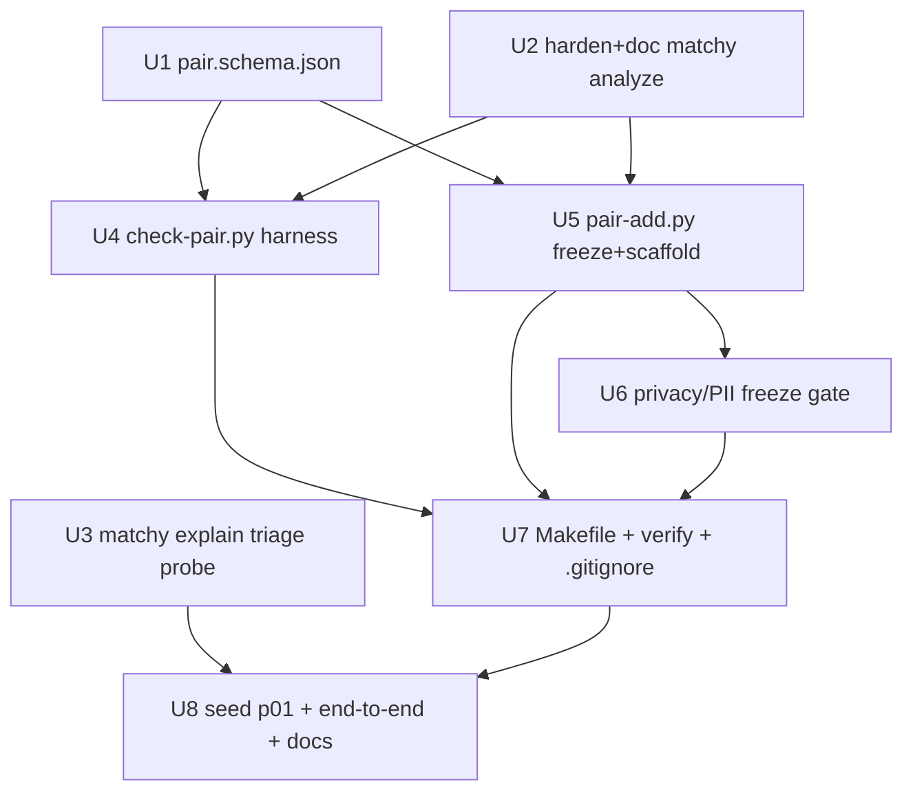

# feat: M9 — Real-Pair Regression Fixtures (testbed Tier 3)

## Summary

Build the convenience tier that turns any real old/new URL pair where `matchy` misses a defect or floods noise into a frozen, deterministic, asserted, CI-gated regression fixture. The analysis engine already exists (`matchy analyze --old-bundle/--new-bundle` replays two saved bundles offline and byte-deterministically); this milestone wraps that primitive in a manifest schema, a hermetic replay-and-assert harness that reuses the Tier-1 matcher engine, three `make` targets, a privacy/PII freeze gate, one small read-only `matchy explain` triage subcommand, and one committed seed fixture captured from a real Webflow-staging → localhost rebuild pair.

---

## Problem Frame

The user's intended loop — *"as I use this tool I'll hit old/new URL examples where matchy misses things; add them to the bench and fix the tool"* — is unsupported today. Tier 1 (synthetic permutation variants) is precise but can't model real-world inputs; Tier 2 (M6 calibration pairs) captured real URLs but was human-triaged, gitignored, and run once. The gap is the convenience tier, not the engine. See origin: `docs/prds/real-pair-fixtures-spec.md` §0.

---

## Requirements

- **R1.** A contributor adds a regression fixture from two real URLs with one command (`make pair-add`), and it becomes a permanent, CI-gated test (`make pair`, `verify` step). *(origin G-R1)*
- **R2.** Fixtures are deterministic and hermetic — replay from frozen bundles with no Chromium/Playwright/testbed servers/network, so they run in minimal CI. *(origin G-R2)*
- **R3.** Fixtures encode intent, not current output — a missed-defect fixture is red-on-purpose (FN/TDD), a noise-flood fixture asserts a ceiling (FP). The `pair-add` stub never auto-populates `required` from current output. *(origin G-R3)*
- **R4.** Reuse the `expected-issues.json` contract and golden machinery unchanged; add the minimum new surface. `check-pair.py` reuses `check-fixture.py`'s matcher engine — no second DSL implementation. *(origin G-R4)*
- **R5.** Committed captures are redaction-clean, PII-reviewed, and size-budgeted; the freeze step fails closed otherwise. *(origin G-R5)*
- **R6.** A clean promotion path exists from a Tier-2 pair to a Tier-3 fixture (`frozen`/`refreshPolicy` fields, `pair-refresh`). *(origin G-R6)*
- **R7.** `matchy analyze` honors `--profile`, `--baseline`, and `--fail-on`, with exit codes `0`/`1`/`2` matching build spec §14, and is promoted to a documented, supported entrypoint. *(origin R-CLI-1/2/3)*
- **R8.** `matchy explain` is a hermetic, anchor-aware computed-style/bbox triage probe over the frozen bundles (no browser/network). *(origin R-CLI-4)*
- **R9.** SHA-256 integrity of both bundles is enforced on every run; mismatch is a hard error (exit 2). *(origin §3)*
- **R10.** At least one committed seed fixture demonstrates a real false-negative/false-positive caught and locked, and the full loop is exercised end-to-end and documented. *(origin §11 DoD 5/7)*
- **R11.** A red-on-purpose fixture (expected-red FN/FP) does **not** break the `make verify` CI gate: `check-pair.py` treats a correctly-red expected-red fixture as a passing `xfail`, so the user's "commit red → fix later" TDD loop is expressible on `main`. *(resolves the tension between origin G-R3's "red on purpose" and §7's gating `verify` — neither origin doc defines this mechanism)*

**Origin note:** the origin is a PRD (`docs/prds/real-pair-fixtures-spec.md`), subordinate to the v3 build spec (`docs/prds/page-pair-diff-spec.md`); it uses G-R / R-CLI codes rather than formal A/F/AE IDs. The build spec wins on any conflict.

---

## Scope Boundaries

- **No live re-capture in CI.** Fixtures replay frozen bundles only; re-capture is the explicit manual `pair-refresh` action.
- **No crawling, auth, or interaction.** Capture uses the existing `matchy` capture path and flags, unchanged.
- **No new analysis capability.** If a seed fixture is red because matchy genuinely cannot yet detect the defect, fixing that is downstream work scoped by whichever build-spec goal (G1–G8) it falls under — not part of M9.
- **No change to the `expected-issues` matcher DSL semantics.** The contract and its schema are reused verbatim; only the application domain widens from variants to pairs.
- **Not a replacement for Tier 1.** Synthetic single-change variants remain the precise feature tests.
- **`matchy explain --live` mode is out of scope** (the hermetic frozen-bundle mode is the deliverable; the optional `--live URL_OLD URL_NEW` mode is explicitly excluded from the M9 DoD).
- **Git-LFS is out of scope** — bundles stay plain committed JSON, guarded by a size budget.
- **Automated PII detection is out of scope (→ roadmap).** M9 catches PII via the human-review manifest only. Pattern-matching personal data (emails, phone numbers, names) in captured DOM text, screenshots, or `data:` URIs is deferred (user decision, 2026-06-16). Credential/token redaction is **not** PII and stays in M9.

### Deferred to Follow-Up Work

- **Automated PII detection (roadmap):** email/phone/SSN scanning over captured DOM text, plus screenshot and `data:`-URI content scanning — an automated backstop to the human-review manifest. Deferred per user scope decision (2026-06-16); covers the round-2 findings on screenshot PII (`--yes`-skippable) and `computedStyles` `data:` URIs.
- **Downstream analysis fix to green a red FN seed:** separate PR, scoped by the relevant G-goal (only if the seed triages as a genuine false-negative matchy cannot yet catch).
- **Additional real pairs beyond `p01`:** added by the user via `make pair-add` as real migration failures are hit.
- **Auto-deriving `required` matchers for true-positive promotion:** deferred (origin §12); rejected for FN/FP cases.

---

## Context & Research

### Relevant Code and Patterns

- **Replay engine (exists):** `packages/analyze/src/bin/matchy.rs` — `CliCommand::Analyze(AnalyzeArgs)` and `run_analyze(...)` (≈ line 516). `--old-bundle/--new-bundle/--out` works and schema-validates output. `--profile`/`--baseline`/`--scope` are `global = true` and already flow into `run_analyze`; **`--fail-on` does not** (only `run_full` calls `compute_exit_code(&result, fail_on)`).
- **CaptureBundle shape:** `packages/analyze/src/contract.rs` — `CaptureBundle`; fields the scaffold/gate need: `page.finalUrl`, `environment.chromiumBuild`, `determinism.hidden[]`/`determinism.masked[]`, `page.network.requests[].url` + `page.redirectChain`, `computedStyles[node_<N>][prop]` (`BTreeMap<String,BTreeMap<String,String>>`), `page.nodes[]` (`SemanticNode` with `anchors`, `bbox`), `Anchors` struct (8 fields incl. `text`/`role`/`href`/`nearestHeading`).
- **Anchor locator (reused by `explain`):** `packages/analyze/src/region_link.rs` — `link_region()`, `find_candidate()` (distinctive-anchor + ≥30% bbox overlap, sorted by seqIndex then id), `node_to_anchors()`, `LinkResult`.
- **Matcher engine (reused by `check-pair.py`):** `testbed/check-fixture.py` — `_type_matches`, `_substring`, `evaluate_expected_issues(diff_result, expected)` (required greedy / forbidden / status / maxIssues / clusters), and an existing `--expected`/`--diff-result` **unit mode** that evaluates matchers with no servers and no `matchy` run.
- **Golden loop (unchanged, p-prefix rides it):** `testbed/compare-golden.py` — `EXCLUDED_KEYS = {runId, capturedAt}`, `FLOAT_TOLERANCE = 1e-4`. `Makefile` ≈ lines 87–97 globs `testbed/goldens/*.diffresult.json` and diffs each against `testbed/.runs/<basename>/diff-result.json`.
- **Capture output + redaction:** bundles are written to `<out>/<viewport>/<prefix>.bundle.json` (e.g. `<tmp>/desktop/old.bundle.json`) — **not** flat in `<out>`. `packages/capture/src/normalize.ts` — `redactUrl()` + `DEFAULT_REDACT_PARAMS` (`token,sig,signature,key,auth,apikey,access_token`); `packages/capture/src/capture.ts` — Authorization/Cookie/Set-Cookie headers are never recorded; `packages/capture/src/stabilizer.ts` — `--hide`/`--mask` application recorded into `determinism.hidden/masked`.
- **Sibling harness conventions:** `testbed/check-fixture.py`, `testbed/check-m8.py`, `testbed/run-all.py`, `testbed/determinism-check.py`; schemas in `testbed/schemas/{expected-issues,manifest}.schema.json`.

### Institutional Learnings

- No `docs/solutions/` in this repo. Relevant durable context: ports migrated to `47xxx` to dodge a `next-server` on `:3001` — note the seed's **new** URL is `http://localhost:3001/...`, i.e. that same local dev server (the rebuild under test), unrelated to the testbed ports.
- Golden discipline (CLAUDE.md): a failing fixture defaults to fix-the-code; weakening an existing expectation needs a `docs/golden-changelog.md` entry + `golden-auditor` APPROVE. **Adding a brand-new red fixture is not a golden change** and needs no auditor sign-off (origin §4).
- Model routing (CLAUDE.md): mechanical capture/freeze → `fixture-builder`/`test-runner`; code → `code-implementer` (serial, never parallel — see memory); expected-output authoring + golden rationale stay in the main session.

### External References

- Origin spec: `docs/prds/real-pair-fixtures-spec.md` (§§2–11). Build spec: `docs/prds/page-pair-diff-spec.md` (§5 anchors, §14 CLI, §15 determinism).

---

## Key Technical Decisions

- **Separate `testbed/check-pair.py` that reuses the Tier-1 engine.** Import `evaluate_expected_issues`/`_type_matches`/`_substring` from `check-fixture.py` (or shell out to its `--expected`/`--diff-result` unit mode). The capture/replay front-halves differ; the matcher back-half is shared. Rationale: origin §5/§12 — engine reuse is the non-negotiable, not file count.
- **Shared `testbed/goldens/` with `p`-prefixed case-ids.** Pair goldens ride the existing Makefile glob with zero Makefile change, provided the pair step writes `testbed/.runs/<case>/diff-result.json` before the golden loop. Rationale: origin §6/§12.
- **`pair-add` logic lives in `testbed/pair-add.py`, invoked by the make target.** Freeze-from-viewport-subdir + SHA-256 + manifest scaffold + privacy gate is real logic, not a one-liner. The make targets stay thin wrappers.
- **`matchy explain` is a new `Explain` subcommand** reusing `region_link.rs` anchor resolution and `contract.rs` `Anchors`/`computedStyles`; it surfaces data already in the bundle (no taxonomy/scoring/matching). Hermetic bundle mode only.
- **R-CLI-2 fix is additive:** thread `--fail-on` into `run_analyze` so analyze's exit code honors the global flag like `run_full` does; confirm `--profile`/`--baseline`/`--scope` propagation (already present).
- **The `pair-add` stub never auto-populates `required`** from current output — the current output is presumed wrong (that's why the pair is added). Intent is authored by hand per origin §4.
- **Frozen pairs preserve the `<viewport>/` subdir and commit screenshot PNGs alongside the bundles.** Verified against `matchy.rs` `run_analyze` (≈ lines 548–562): it resolves each screenshot as `bundle_path.parent().parent().join(bundle.screenshots.full_page)`, and `analyze_viewport` hard-requires the PNGs (`diff_images`/`image::open` propagate `?` on a missing file — there is **no** missing-image guard). A flat freeze breaks the path math and replay exits `2`. So bundles freeze at `testbed/pairs/<case>/<viewport>/<prefix>.bundle.json` with `<prefix>.png` alongside. This needs **no analyze-engine change** (respects the "no new analysis features" non-goal) and keeps Tier-3 diff-results byte-identical to live runs.
- **Expected-red (`xfail`) fixture state.** `pair.json` carries `expectedState: "green" | "red"`. `check-pair.py` maps it to gate-safe exit codes: a correctly-red expected-red fixture → exit `0` reported as `XFAIL` (locks a pending FN/FP without breaking CI); an expected-red fixture that has gone green → `XPASS` (non-fatal, prompts flipping it to green); an expected-green fixture that is red → exit `1` (a real regression). This is the mechanism the "commit red, fix later" loop requires (R11).
- **Privacy gate fails closed on credentials; PII is handled by human review (automated PII detection is roadmapped, not M9).** The hard automated check is a token/secret-shaped-param scan over every URL-bearing field (`network.requests[].url`, `page.redirectChain`, `page.nodes[].src`/`rawHref`, `page.linkProbes[].url`/`redirectChain`/`finalUrl`) — this enforces **credential** redaction (origin §8 / DoD-6), not PII. PII in visible page content / screenshots is surfaced by the human-review manifest (origin §8 "Human PII review gate"), which `--yes` skips — so `--yes` is for trusted / already-reviewed re-freezes only. **Automated PII *detection* (email/phone over DOM text, screenshot/`data:`-URI content scanning) is out of scope for M9 → roadmap** (user decision, 2026-06-16). There is **no** bundle field recording "redaction ran" (redaction is unconditional in `capture.ts`), so the gate relies on the positive token-scan, not a metadata flag.

---

## Open Questions

### Resolved During Planning

- *One harness or two?* → Separate `check-pair.py` reusing the engine (origin §12 left to impl).
- *Goldens dir shared or dedicated?* → Shared `testbed/goldens/` with `p`-prefix (origin §12).
- *Does analyze honor profile/baseline/fail-on today?* → profile + baseline yes; **fail-on no** — add it (U2).
- *Can frozen bundles replay alone?* → **No** — `matchy analyze` hard-requires the screenshot PNGs and resolves them via `bundle.parent().parent()/screenshots.full_page` (code-verified). Resolution: freeze under a `<viewport>/` subdir and commit the PNGs; no analyze-engine change.
- *How does a red-on-purpose FN coexist with a gating `verify`?* → New `expectedState: green|red` field + `xfail`/`xpass` handling in `check-pair.py` (R11). Neither origin doc defined this; it's the mechanism the user's TDD loop needs.
- *Seed source, given M6 bundles are gone from disk?* → Capture a real URL pair now: `p01-hiya-number-registration`, OLD `https://hiya-com-temp-43830deaa570809d11aa88b1f.webflow.io/products/connect/number-registration`, NEW `http://localhost:3001/products/connect/number-registration` (user's own Hiya page; fallback in U8 if the temp host is dead).

### Deferred to Implementation

- **Seed `demonstrates` + `expectedState` values:** determined at capture time by triaging the real diff with `matchy explain`; not knowable until the bundles exist.
- **Whether a downstream analysis fix is needed to green a red FN seed:** out of M9 scope; decided post-capture (origin §1 non-goals). The red `xfail` is gate-safe in the meantime.
- **Exact `knownDrift` pin-out matchers for the seed:** authored after seeing the real Webflow→localhost diff (incidental rebuild drift is expected; seed from the `--self-check` `volatile_capture` warnings).
- **Whether to record a byte golden for the seed:** only after it goes green.
- **Whether to also SHA-hash the committed PNGs (not just the bundles) in `pair.json`:** integrity-vs-noise tradeoff; bundle hashing is the floor.
- **`check-pair.py` engine reuse: import vs shell-out** to `check-fixture.py`'s unit mode — both satisfy the no-second-implementation rule; the import path needs `check-fixture.py` to expose clean symbols.
- **`capturedAt` source for the scaffold:** bundle environment vs capture wall-clock (minor; `chromiumBuild` is `environment.chromiumBuild`).

### Needs a Human Decision (surfaced from doc review)

- **Repo visibility & external-capture consent.** Is `MatchyMatchy` public or private? It changes the bar for committing captured page content. For the seed it's moot (the captured page is the user's own Hiya product page), but `pair-add` should require contributors to assert ownership/rights before freezing any *future external* pair. Confirm the repo's visibility and whether to add that assertion gate now or defer.

---

## Output Structure

    testbed/
      schemas/
        pair.schema.json                 # NEW — validates pair.json incl. expectedState (U1)
      pairs/                             # NEW — tracked Tier-3 fixtures
        p01-hiya-number-registration/    # NEW — seed (U8)
          pair.json                      # provenance + integrity manifest (+ expectedState)
          expected-issues.json           # hand-authored intent
          baseline.json                  # OPTIONAL accept-list
          desktop/                       # <viewport> subdir — analyze resolves screenshots relative to its parent
            old.bundle.json              # frozen Webflow-staging capture
            new.bundle.json              # frozen localhost:3001 capture
            old.png / old-vp.png         # frozen screenshots — analyze HARD-REQUIRES these
            new.png / new-vp.png
      goldens/
        p01-hiya-number-registration.diffresult.json   # OPTIONAL byte golden (after green)
      check-pair.py                      # NEW — replay + integrity + xfail + reuse Tier-1 engine (U4)
      pair-add.py                        # NEW — capture → gate → freeze → scaffold (U5)
      pair_privacy.py                    # NEW — redaction/PII freeze gate (U6)
      .runs/
        p01-hiya-number-registration/    # gitignored working output
    packages/analyze/src/
      explain.rs                         # NEW — matchy explain logic (U3)
      bin/matchy.rs                      # MODIFY — Explain subcommand + analyze --fail-on (U2/U3)

Why the `<viewport>/` nesting (not flat): `matchy analyze` resolves each screenshot as
`bundle_path.parent().parent().join(bundle.screenshots.full_page)`. With the bundle at
`pairs/<case>/desktop/old.bundle.json`, `parent().parent()` = `pairs/<case>/` and
`screenshots.full_page` (`"desktop/old.png"`) resolves to `pairs/<case>/desktop/old.png`. A flat
freeze would resolve to `pairs/desktop/old.png` and abort.

---

## High-Level Technical Design

> *This illustrates the intended approach and is directional guidance for review, not implementation specification. The implementing agent should treat it as context, not code to reproduce.*

Two flows share the frozen bundles as their source of truth:

```
ADD (one-time, only step touching network/browser):
  make pair-add CASE URL_OLD URL_NEW [PROFILE VIEWPORT HIDE MASK]
    └─ matchy --old URL_OLD --new URL_NEW --out <tmp> --self-check   (live capture + volatility probe)
        └─ <tmp>/<viewport>/{old,new}.bundle.json + {old,new}.png
            └─ privacy gate FIRST (credential token/secret scan, fail-closed; + human manifest
                 review of text/screenshots/data-URIs — automated PII detection is roadmapped)
                 ──fail──> abort, NOTHING written to the tracked tree
            └─ freeze → testbed/pairs/<CASE>/<viewport>/{old,new}.bundle.json + PNGs  (preserve <vp>/ nesting)
            └─ sha256(bundles) + scaffold pair.json (urls, finalUrl, capturedAt, chromiumBuild,
                 flags, viewport, expectedState, volatile_capture warnings → knownDrift seed)
            └─ matchy analyze (seed .runs/<CASE>/diff-result.json)
            └─ write expected-issues.json STUB (status + EMPTY required/forbidden + notes)

TRIAGE + AUTHOR (main session):
  matchy explain --old-bundle <case>/<vp>/old.bundle.json --new-bundle … --anchor "text=…"  (hermetic delta)
    └─ classify FN / FP / TP → hand-author expected-issues.json + set pair.json expectedState
                                (red if a pending FN/FP the code can't yet handle)

ASSERT (hermetic, every CI run — no servers/network):
  make pair CASE  ──>  python3 testbed/check-pair.py CASE
    1. load+validate pair.json against pair.schema.json
    2. sha256(<vp>/{old,new}.bundle.json) == pair.json ?  ── no ──> exit 2
    3. matchy analyze --old-bundle <case>/<vp>/old.bundle.json --new-bundle … --out .runs/<CASE> [--profile --baseline]
         (screenshots resolve via bundle.parent().parent()/screenshots.full_page — hence the <vp>/ nesting)
    4. schema-validate diff-result.json against /contract/diff-result.schema.json
    5. evaluate expected-issues.json via REUSED check-fixture engine, reconciled with expectedState:
    └─ exit 0  = pass; OR a correctly-red expected-red fixture (XFAIL); OR expected-red gone green (XPASS, warn)
       exit 1  = an expected-green fixture is red (real regression / unmet required matcher)
       exit 2  = harness/tool error (bad manifest, sha mismatch, analyze non-{0,1}, schema violation)

  make verify  ──>  … ; Tier-3 pair loop (BEFORE golden loop) ; golden loop (p-prefix rides existing glob)
```

---

## Implementation Units



### U1. `pair.schema.json` manifest contract

**Goal:** Add `testbed/schemas/pair.schema.json` validating the `pair.json` provenance/integrity manifest per origin §3.

**Requirements:** R1, R6, R9

**Dependencies:** None

**Files:**
- Create: `testbed/schemas/pair.schema.json`
- Test: `testbed/tests/test_pair_schema.py` (or fold validation assertions into U4's harness tests; mirror how `manifest.schema.json` is validated today)

**Approach:**
- Encode all origin §3 fields: `caseId` (`^p[0-9]{2,}-[a-z0-9-]+$`), `description`, `demonstrates` (enum `false-negative|false-positive|true-positive|mixed`), `discoveredVia`, `goals` (array `^G[1-8]$`), `profile`, `viewport` (the subdir name the bundles freeze under — analyze derives screenshot paths relative to its parent), `old`/`new` objects (`url`, `finalUrl`, `capturedAt` ISO-8601, `sha256` 64-hex, `chromiumBuild`), `captureFlags` (array), `baseline` (string|null), `knownDrift` (array, optional), `frozen` (const `true` in v1), `refreshPolicy` (enum `never|on-demand`).
- Add **`expectedState`** (enum `green|red`, required) — the `xfail` signal `check-pair.py` reconciles against (see Key Technical Decisions / R11). `demonstrates` records *what kind* of case it is; `expectedState` records whether it should currently pass (`green`) or is a locked pending red (`red`).
- `required` list matches the origin "Required" column; `additionalProperties: false` for tight validation.

**Patterns to follow:** `testbed/schemas/manifest.schema.json`, `testbed/schemas/expected-issues.schema.json` (draft version, `$id` convention).

**Test scenarios:**
- Happy path: a fully-populated valid `pair.json` (the U8 seed shape) validates.
- Edge case: `caseId` `v01-foo` (wrong prefix) is rejected by the pattern; `p1-foo` (one digit) rejected.
- Edge case: `demonstrates: "regression"` (not in enum) rejected; `goals: ["G9"]` rejected.
- Edge case: `sha256` of wrong length (not 64 hex) rejected; missing any `required` field rejected. This schema-level `sha256` format check is covered by **U1's own** test, not deferred to U4 — whether the test is standalone or folded into U4's suite.
- Edge case: `frozen: false` rejected in v1 (const true); `expectedState: "pending"` (not in `green|red`) rejected; missing `expectedState` rejected.

**Verification:** A hand-written valid manifest passes and each malformed mutation above fails, via the chosen JSON-schema validator (same library the harness uses).

---

### U2. Harden and document `matchy analyze` (R-CLI-1/2/3)

**Goal:** Make `matchy analyze` a fully-flagged, documented, supported entrypoint: honor `--fail-on` (currently ignored on the analyze branch), confirm `--profile`/`--baseline`/`--scope` propagation, and document it in the build spec §14.

**Requirements:** R7

**Dependencies:** None

**Files:**
- Modify: `packages/analyze/src/bin/matchy.rs` (thread `fail_on` into `run_analyze`; confirm profile/baseline/scope)
- Modify: `docs/prds/page-pair-diff-spec.md` (§14 — promote `analyze` from "for determinism verification" to documented entrypoint; document `analyze` exit codes)
- Test: a CLI integration test for `analyze` exit codes. NOTE: `packages/analyze/` has **no** `tests/` dir today — all tests are inline `#[cfg(test)]` modules — so this unit *establishes* the convention (an `assert_cmd`-style binary-invocation test under `packages/analyze/tests/`, or an inline test calling `run_analyze` directly). Do not "mirror existing CLI conventions" — there are none.

**Approach:**
- `run_analyze` already calls `compute_exit_code(&result, "error")` with a **hardcoded** literal — thread a `fail_on: &str` parameter through it instead and pass `&cli.fail_on` from the `Analyze` match arm, matching `run_full`. (`--profile`/`--baseline`/`--scope` already reach `run_analyze`; just confirm.)
- Verify `--profile`/`--baseline`/`--scope` already reach `run_analyze` (they do); add the `analyze` row to §14 with the `0`/`1`/`2` exit-code contract and a note that `--viewport` is irrelevant to analyze (bundle carries its own).

**Execution note:** Start from a failing assertion that `matchy analyze --fail-on never` on a known-issue bundle pair exits `0` (today it would not respect the flag), then make it pass.

**Patterns to follow:** the `run_full` exit-code path in `matchy.rs` (`compute_exit_code`); the existing global-flag plumbing for `profile`/`baseline`.

**Test scenarios:**
- Happy path: `analyze` on a pair with issues + `--fail-on never` exits `0`; with default `--fail-on error` exits per status (`1` when status warrants).
- Integration: `--profile strict-visual` vs `content-structure` on the same bundles yields different scoring in `diff-result.json` (proves profile reaches analyze).
- Integration: `--baseline <accept-list>` suppresses listed issue ids in the analyze output.
- Error path: malformed bundle path → exit `2`; output `diff-result.json` validates against `/contract/diff-result.schema.json`.

**Verification:** `matchy analyze` exit codes match build spec §14 across `--fail-on` settings; profile/baseline/scope demonstrably affect output; §14 documents the subcommand.

---

### U3. `matchy explain` — hermetic style/bbox triage probe (R-CLI-4)

**Goal:** Add a read-only `Explain` subcommand that locates a node by anchor/node-id/selector across two frozen bundles and prints the per-side computed-style + bbox values, highlighting differences — the fact-check that classifies a case as FN vs FP.

**Requirements:** R8

**Dependencies:** None (reuses existing `region_link.rs` + `contract.rs`)

**Files:**
- Create: `packages/analyze/src/explain.rs`
- Modify: `packages/analyze/src/bin/matchy.rs` (add `CliCommand::Explain(ExplainArgs)` + handler)
- Modify: `packages/analyze/src/lib.rs` (export `explain` module) and `docs/prds/page-pair-diff-spec.md` §14 (document `explain` alongside `analyze`)
- Test: `packages/analyze/tests/explain.rs`

**Approach:**
- `ExplainArgs`: `--old-bundle`, `--new-bundle`, one of `--anchor "text=…|role=…|href=…|nearestHeading=…"` / `--node node_<N>` / `--selector "<css>"`, optional `--props color,font-family,gap,…` (default: extracted set, diff-only).
- Locate the node by the anchor-set model in `region_link.rs`. NOTE: `find_candidate`/`node_to_anchors` are **private** (`fn`, not `pub fn`), and `link_region` resolves by a visual `Rect`, not by an anchor string like `text=…`. So `explain` needs either (a) `pub`-exporting those helpers, or (b) a small new anchor-string→node resolver in `explain.rs` filtering `page.nodes[]` on text/role/href/nearestHeading — do **not** assume turnkey reuse. `--node`/`--selector` are escape hatches against the bundle's `computedStyles` keys / `page.nodes`.
- Read each side's `computedStyles[node_id]` + `page.nodes[].bbox`, print a per-property old→new table highlighting differences. No taxonomy, scoring, or matching — surfaces existing bundle data only.
- This generalizes the M6 `style-compare.cjs` calibration probe (hardcoded URLs, live re-capture, CSS-only — an untracked scratch file, not a committed entrypoint) into a hermetic, anchor-aware form. §14 should describe `explain` on its own terms rather than cross-referencing a file that may not be in the tree.

**Execution note:** Hermetic — no browser/network. Author against the U8 seed bundles once they exist, but unit-test against any committed bundle pair (e.g. a `testbed/.runs` fixture or a small synthetic bundle).

**Technical design:** *(directional)*
```
explain(old_bundle, new_bundle, locator, props?):
  node_id = resolve(locator, old_bundle, new_bundle)   # reuse region_link anchor model
  old = old_bundle.computedStyles[node_id] + old_bundle.node(node_id).bbox
  new = new_bundle.computedStyles[node_id] + new_bundle.node(node_id).bbox
  keys = props or union(old, new) filtered to differing   # diff-only by default
  print table: property | old | new | changed?
```

**Patterns to follow:** `region_link.rs` locator code; `contract.rs` `Anchors`/`SemanticNode`/`computedStyles`; the `Analyze` subcommand wiring in `matchy.rs`.

**Test scenarios:**
- Happy path: `--anchor "text=Get started"` resolves the CTA node and prints differing props (e.g. `background-image` gradient→none) marked changed.
- Edge case: `--props color,font-family` restricts output to those props even if unchanged; default mode prints only differing props.
- Edge case: `--node node_42` and `--selector ".hero .cta"` escape hatches resolve the same node as the equivalent anchor.
- Error path: anchor matches no node → clear "node not found" message, non-zero exit; node present on one side only → reports the asymmetry rather than panicking.
- Integration: output reflects exactly the `computedStyles` matchy consumed (run `explain` and `analyze` on the same bundles; the values agree).

**Verification:** `matchy explain` resolves a node by anchor from frozen bundles and prints the per-side computed-style/bbox delta with no browser/network; documented in §14.

---

### U4. `check-pair.py` replay-and-assert harness

**Goal:** Add `testbed/check-pair.py`, the Tier-3 sibling of `check-fixture.py`, that replays a frozen pair offline and asserts its `expected-issues.json` by reusing the Tier-1 matcher engine.

**Requirements:** R2, R4, R9

**Dependencies:** U1 (schema), U2 (analyze flags)

**Files:**
- Create: `testbed/check-pair.py`
- Test: `testbed/tests/test_check_pair.py` (mirror any existing harness test style; otherwise drive via fixtures)

**Approach:** `python3 testbed/check-pair.py <case-id> [--matchy PATH] [--skip-run]`:
1. Load + validate `testbed/pairs/<case>/pair.json` against `pair.schema.json` (U1); read `viewport` + `expectedState`.
2. Recompute SHA-256 of `<viewport>/old.bundle.json` / `<viewport>/new.bundle.json`; abort exit `2` on mismatch.
3. Replay (unless `--skip-run`): `matchy analyze --old-bundle testbed/pairs/<case>/<viewport>/old.bundle.json --new-bundle …/new.bundle.json --out testbed/.runs/<case>/ --profile <pair.profile> --fail-on never [--baseline …]` → `testbed/.runs/<case>/diff-result.json`. Pass **`--fail-on never`** so analyze always exits `0` on a clean run — a real FN/FP pair would otherwise make analyze exit `1` under the default `--fail-on error`, and `check-pair.py` (not analyze) owns the pass/xfail verdict from `expectedState` + matchers. Treat analyze exit `{0,1}` as "ran fine" and only non-`{0,1}` as a tool error. The `<viewport>/` nesting is **required**: analyze reads `bundle.parent().parent()/screenshots.full_page` and hard-errors on a missing PNG. No servers/Playwright/network.
4. Schema-validate the emitted `diff-result.json` against `/contract/diff-result.schema.json` (as `check-fixture.py` does).
5. Evaluate `expected-issues.json` via the **shared** engine — import `evaluate_expected_issues`/`_type_matches`/`_substring` from `check-fixture.py`, or shell out to `check-fixture.py --expected … --diff-result …` unit mode.
6. Reconcile with `expectedState` and exit: `green` + all matchers satisfied → `0`; `green` + a matcher fails → `1`; `red` + matchers still unmet (correctly red) → `0` reported `XFAIL`; `red` + matchers now satisfied → `0` reported `XPASS` (warn: flip to green); harness/tool error → `2`.

**Execution note:** Engine reuse is non-negotiable — do not reimplement the matcher DSL. A test must prove `check-pair.py` and `check-fixture.py` unit mode produce identical verdicts on the same `(expected, diff-result)` pair.

**Patterns to follow:** `testbed/check-fixture.py` (arg parsing, schema validation, exit-code conventions, `--skip-run`); `testbed/check-m8.py` as a structural sibling.

**Test scenarios:**
- Happy path: `expectedState: green` pair whose `diff-result` satisfies all matchers → exit `0` (PASS).
- xfail: `expectedState: red` + a required matcher still unmet (correctly red) → exit `0` reported `XFAIL` — does **not** break the gate.
- xpass: `expectedState: red` + the required matcher now satisfied → exit `0` reported `XPASS` (warns to flip to green).
- Regression: `expectedState: green` + a required matcher unmet → exit `1`; a `forbidden`/`maxIssues` ceiling violated on a green pair → exit `1`.
- Error path: tampered bundle (sha mismatch) → exit `2` with a loud message; missing/invalid `pair.json` → exit `2`.
- Edge case: `--skip-run` reuses an existing `.runs/<case>/diff-result.json` without invoking matchy.
- Error path (layout guard): a flat-layout pair (no `<viewport>/` subdir, screenshots unresolvable) makes analyze exit non-zero → check-pair exits `2`.
- Edge case (F2): analyze is invoked with `--fail-on never`; a real FN/FP pair (which would exit `1` under default `--fail-on error`) does not trip the harness — the verdict comes from `expectedState` + matchers, and analyze exit `{0,1}` is accepted.
- Integration: same `(expected, diff-result)` evaluated by `check-pair.py` and by `check-fixture.py --expected/--diff-result` yields identical PASS/FAIL rows (engine-reuse guard).

**Verification:** Running the harness on a committed pair replays hermetically and exits `0`/`1`/`2` exactly per origin §5; the engine-reuse guard test passes.

---

### U5. `pair-add.py` — capture, freeze, scaffold

**Goal:** Add `testbed/pair-add.py` implementing the capture→freeze→scaffold steps of `make pair-add` (origin §7), producing a frozen, schema-valid fixture with a stub expectation.

**Requirements:** R1, R3, R6

**Dependencies:** U1 (schema), U2 (analyze), U6 (privacy gate — `pair-add.py` calls it before freeze)

**Files:**
- Create: `testbed/pair-add.py`
- Test: `testbed/tests/test_pair_add.py`

**Approach:** `pair-add.py --case <id> --url-old … --url-new … [--profile --viewport --hide --mask --yes]`:
1. Run live capture once **with `--self-check`**: `matchy --old URL_OLD --new URL_NEW --out <tmp> --self-check [--profile --viewport --hide --mask]` (the only network/browser step). `--self-check` re-captures old-vs-old and surfaces a `volatile_capture` warning, so volatility (analytics, A/B, consent banners, rotating content) is visible *before* freeze rather than baked silently into the fixture.
2. **Locate the produced artifacts in the viewport subdir** — `<tmp>/<viewport>/{old,new}.bundle.json` **and the screenshot PNGs** (`<tmp>/<viewport>/{old,new}.png`, `*-vp.png`). Capture writes to `<out>/<viewport>/`, not flat.
3. **Run the privacy gate (U6) FIRST — before writing anything into `testbed/pairs/`** — operating on the temp artifacts. Abort (nothing in the tracked tree) if it trips.
4. Freeze **preserving the `<viewport>/` nesting**, copying an **explicit allowlist** — `{old,new}.bundle.json` + `{old,new}.png` + `{old,new}-vp.png` — into `testbed/pairs/<case>/<viewport>/`. Do **not** copy `<tmp>/<viewport>/*` wholesale: `--self-check` (step 1) also writes `old-selfcheck.{bundle.json,png,-vp.png}` there, which must never be committed. Consume `<tmp>/self-check.json` for the `knownDrift` seed (step 5), then discard it. Compute SHA-256s of the two frozen bundles. (The nesting is load-bearing — see Key Technical Decisions.)
5. Write `pair.json` scaffold: `url` (as requested), `finalUrl` (from `page.finalUrl`), `capturedAt`, `chromiumBuild` (from `environment.chromiumBuild`), `captureFlags`, `viewport` (the subdir name), the two bundle `sha256`s, `frozen: true`, `refreshPolicy: "never"`, `expectedState: "red"` (default — a freshly-added pair is presumed to expose a not-yet-handled defect; the author flips it during triage), and any `volatile_capture` warnings seeded into `knownDrift`.
6. Seed `matchy analyze` on the frozen bundles → `testbed/.runs/<case>/diff-result.json`.
7. Write `expected-issues.json` **STUB** — `status` + **empty** `required`/`forbidden` + a `notes` reminder. Do **not** auto-populate `required` from the current (presumed-wrong) output.
8. Support `--refresh` mode (used by `pair-refresh`, U7): re-capture using the recorded `captureFlags`, rewrite both bundles + PNGs + their hashes, **re-run the privacy gate** (page content may have changed since the original freeze); leave `expected-issues.json` and `expectedState` untouched.

**Execution note:** Capture/freeze is mechanical → delegate to `fixture-builder`. The stub-not-scrape rule (step 7) is load-bearing for R3 and must be enforced in code, not left to discipline.

**Patterns to follow:** `matchy.rs` `run_full` flags (`--hide`/`--mask`/`--viewport`/`--profile`); `testbed/run-all.py` for subprocess + path handling conventions.

**Test scenarios:**
- Happy path (mocked capture): given `<tmp>/<viewport>/{old,new}.bundle.json` + PNGs, freeze **preserves** the `<viewport>/` nesting under `pairs/<case>/<viewport>/` (bundles **and** PNGs), and the recorded `sha256` matches the frozen bundle bytes.
- Happy path: `pair.json` `finalUrl`/`chromiumBuild`/`viewport` are populated from the bundle (not the requested URL/host); `expectedState` defaults to `red`.
- Edge case: the stub `expected-issues.json` has empty `required`/`forbidden` (assert it does **not** mirror `diff-result.issues`).
- Error path: the privacy gate runs **before** the freeze — a gate trip leaves `testbed/pairs/<case>/` absent/untouched (no partial write).
- Edge case: `--refresh` rewrites bundles + PNGs + hashes, re-runs the privacy gate, and does not touch `expected-issues.json` or `expectedState`.
- Integration: a `volatile_capture` self-check warning is surfaced and seeded into `pair.json.knownDrift`.
- Edge case (F1): when `--self-check` produced `old-selfcheck.{bundle.json,png,-vp.png}` + `self-check.json` in `<tmp>/<viewport>/`, the freeze allowlist excludes them — `pairs/<case>/<viewport>/` contains only the old/new bundles + PNGs (assert no `old-selfcheck.*` is committed).

**Verification:** On a fresh capture, `pair-add.py` yields a frozen, schema-valid (`pair.schema.json`), redaction-clean fixture with a stub expectation and a seeded `.runs` diff-result.

---

### U6. Privacy / PII freeze gate

**Goal:** Enforce origin §8 at the freeze boundary: fail closed on token/secret-shaped params in every URL-bearing field (**credential** redaction), and surface page content + screenshots for **human** PII review. **Automated PII detection is out of scope for M9 → roadmap** — PII is caught by the human-review manifest, not by the tool.

**Requirements:** R5

**Dependencies:** None (standalone helper module; `pair-add.py` imports it — U5 → U6, not the reverse)

**Files:**
- Create: `testbed/pair_privacy.py` (gate helper imported by `pair-add.py`)
- Modify: `testbed/pair-add.py` (call the gate at step 3, before freeze)
- Test: `testbed/tests/test_pair_privacy.py`

**Approach:**
- **Token/secret-scan (hard, fail closed):** scan every URL-bearing field — `page.network.requests[].url`, `page.redirectChain`, `page.nodes[].src` / `page.nodes[].rawHref`, and `page.linkProbes[].url` / `redirectChain` / `finalUrl` (some flow into the bundle un-redacted; `redactUrl` only runs on network requests) — for token-shaped params (`DEFAULT_REDACT_PARAMS` + obvious secret shapes). Any hit → abort. This enforces **credential** redaction, not PII.
- **Human review manifest (the PII control for M9):** print external origins, total captured-text length + a sample, inline `data:` URIs, console line count, **and the committed screenshot PNGs** (which can show visible PII), then require explicit confirmation — or `--yes` in headless use. `--yes` skips this interactive confirmation, so it is appropriate **only** for trusted / already-reviewed re-freezes, never a first-time capture of unknown content.
- **No "redaction-ran" metadata check** — there is no such field in the bundle (redaction is unconditional in `capture.ts`). The positive token-scan *is* the redaction enforcement; the gate's error messages must say so rather than implying a metadata flag.
- **Out of scope for M9 (→ roadmap): automated PII *detection*** — email/phone/SSN pattern-matching over DOM text, and screenshot / `data:`-URI content scanning. M9 relies on the human-review manifest for PII; the automated detectors are a roadmap item (see Scope Boundaries). User decision, 2026-06-16.
- **Size budget:** warn when a fixture's **total** committed weight (bundles + PNGs — PNGs dominate, ~1–3 MB each) exceeds a per-fixture budget; suggest `maxTextLength` / `probeLinks:false` and smaller viewports. (Supersedes origin's 2 MB *per-bundle JSON* figure — see Risks.)

**Execution note:** High-risk (credentials). Characterization-style: build a token-bearing fixture first and assert the gate fails closed on it before wiring it into `pair-add`.

**Patterns to follow:** `packages/capture/src/normalize.ts` `DEFAULT_REDACT_PARAMS` (mirror the token names); the bundle field paths from `contract.rs`.

**Test scenarios:**
- Error path: `?access_token=abc123` in a `network.requests[].url`, a `page.nodes[].src`, **or** a `page.linkProbes[].url` → gate fails, non-zero, nothing frozen (origin DoD 6).
- Happy path: a clean bundle (no token/secret params) → gate passes; the human-review manifest lists external origins, captured-text length, `data:` URIs, console line count, and the screenshot PNGs.
- Edge case: `--yes` skips the interactive manifest confirmation but a token-bearing bundle still fails closed (bypass cannot weaken the credential scan).
- Edge case: a fixture whose total weight (bundles + PNGs) exceeds the budget emits a size warning (non-fatal) and proceeds if otherwise clean.
- *(Roadmap, not M9: automated PII detection over DOM text / screenshots / `data:` URIs.)*

**Verification:** The gate fails closed on token/secret-bearing bundles (incl. via `--yes`) across all URL-bearing fields; the human-review manifest surfaces page content + screenshots for PII review; the size warning fires on total fixture weight. (Automated PII detection is roadmapped, not verified here.)

---

### U7. Makefile targets, `verify` wiring, `.gitignore`

**Goal:** Expose `make pair-add`/`make pair`/`make pair-refresh`, insert the Tier-3 loop into `verify` before the golden loop, and track `testbed/pairs/**`.

**Requirements:** R1, R2, R6

**Dependencies:** U4 (`pair` → `check-pair.py`), U5 (`pair-add`/`pair-refresh` → `pair-add.py`), U6 (gate wired)

**Files:**
- Modify: `Makefile` (three targets + `verify` insertion)
- Modify: `.gitignore` (positive-track `testbed/pairs/**`; keep `testbed/.runs/` ignored)
- Test: covered by U8 end-to-end + a `verify`-ordering assertion

**Approach:**
- `make pair-add CASE=… URL_OLD=… URL_NEW=… [PROFILE= VIEWPORT= HIDE= MASK=]` → `python3 testbed/pair-add.py …`.
- `make pair CASE=…` → `python3 testbed/check-pair.py <CASE>`.
- `make pair-refresh CASE=…` → `python3 testbed/pair-add.py --refresh --case <CASE>` (re-capture with recorded `captureFlags`; a golden-discipline event — note in `docs/golden-changelog.md`).
- Insert a `verify` step **before** the existing golden-comparison step that iterates `testbed/pairs/*/` and runs `check-pair.py <case>` for each, `exit 1` on failure. A correctly-red expected-red fixture returns exit `0` (XFAIL) from `check-pair.py`, so committing a red-on-purpose FN does **not** break the gate (R11) — only an expected-green fixture going red fails `verify`. Ordering matters: pair runs write `.runs/<case>/diff-result.json` before the golden loop diffs them. Because Tier-3 needs no servers, this step runs even when `testbed-up` was skipped.
- `.gitignore`: add a positive rule for `testbed/pairs/**` (bundles, PNGs, `pair.json`, `expected-issues.json`, `baseline.json`) so they are tracked; keep `testbed/.runs/` ignored. (`calibration/.capture/` stays ignored — Tier-2.)

**Patterns to follow:** existing `Makefile` golden loop (≈ lines 87–97) and `fixture`/`testbed-check` target styles; the `=== N/… ===` step-numbering convention (renumber the trailing steps).

**Test scenarios:**
- Integration: `make pair CASE=p01-…` invokes `check-pair.py` and returns its exit code.
- Integration (ordering, concrete mechanism): with a committed `testbed/goldens/p01-….diffresult.json`, deleting `testbed/.runs/p01-…/diff-result.json` and running `make verify` must still pass — proving the pair loop regenerates it *before* the golden step reads it. (A false-green is impossible here because the golden file exists, so a skipped/late pair step surfaces as a missing-`.runs` golden failure.)
- Integration: a committed expected-red fixture that is correctly red passes `make verify` (XFAIL, exit 0); flipping its `expectedState` to `green` while it is still red makes `verify` fail (exit 1).
- Integration: a committed `testbed/goldens/p01-….diffresult.json` is picked up by the existing glob with no Makefile golden-loop edit (p-prefix rides it).
- Edge case: `git check-ignore testbed/pairs/p01-…/desktop/old.bundle.json` reports it as **tracked** (not ignored); `testbed/.runs/…` still ignored.

**Verification:** `make pair`/`pair-add`/`pair-refresh` work; `make verify` runs every committed pair hermetically before goldens and gates on them; bundles are tracked by git.

---

### U8. Seed fixture `p01-hiya-number-registration` + end-to-end loop + docs

**Goal:** Capture and freeze the real seed pair, triage it with `matchy explain`, author its intent, prove the full loop end-to-end, and document Tier 3.

**Requirements:** R3, R10

**Dependencies:** U1–U7 (esp. U3 `explain` for triage, U5/U6 `pair-add`+gate, U4 `check-pair`, U7 make targets)

**Files:**
- Create: `testbed/pairs/p01-hiya-number-registration/{pair.json,expected-issues.json}` + `desktop/{old.bundle.json,new.bundle.json,old.png,new.png}` (and `-vp.png` if used)
- Create (optional, after green): `testbed/goldens/p01-hiya-number-registration.diffresult.json`
- Modify: `README.md` (testbed section — document the Tier-3 loop), `CLAUDE.md` (Testbed layout — add `pairs/` tier)
- Modify (only if an expectation is later weakened): `docs/golden-changelog.md`

**Approach:**
- **Prerequisite (execution-time):** the local rebuild must be serving at `http://localhost:3001/products/connect/number-registration`, and the ephemeral Webflow staging host must still be live; `pair-add.py` aborts early with a clear message if either URL is unreachable. Capture promptly — the `…-temp-<hash>.webflow.io` host can expire; once frozen, host death is irrelevant (provenance is in `pair.json`). **Fallback:** the hiya pair is illustrative, not load-bearing — if the temp host is already dead, U8 may seed from any real old/new pair (e.g. a Wayback-archived old URL vs the live new one, per origin §3) to prove the loop. The DoD wants *a* real pair, not specifically this one.
- The captured page is the user's **own** company product page (`hiya.com`, captured by austin.king@hiya.com), so committing it raises no third-party redistribution concern; the consent/ownership posture in the privacy gate (U6) still applies to any future external pair.
- Run `make pair-add CASE=p01-hiya-number-registration URL_OLD="<webflow>" URL_NEW="http://localhost:3001/products/connect/number-registration" HIDE="<analytics/consent/chat selectors>"` — set explicit `HIDE`/`MASK` for analytics/consent/A-B/chat widgets so the `volatile_capture` self-check stays clean; consider `maxTextLength`/`probeLinks:false` for weight.
- **Triage with `matchy explain`** on the frozen bundles to classify the diff (FN / FP / TP / mixed) from observed per-side computed-style/bbox facts, then **hand-author** `expected-issues.json` (`required` for what matchy *should* emit; `forbidden`/`maxIssues` for noise/known drift; `status`), set `demonstrates`, and set **`expectedState`**: `red` if it is a genuine FN/FP matchy can't yet handle — this **locks** it as a tracked `xfail`, satisfying DoD-5's "demonstrated and locked" *without* breaking `verify` (R11); `green` if matchy already handles it. Declare `knownDrift` (the Webflow→localhost rebuild carries incidental drift — pin it out; seed from the self-check warnings).
- A red `expectedState` fixture is **gate-safe** (XFAIL → exit 0). When the downstream analysis fix lands (separate PR, scoped by the relevant G-goal), flip `expectedState` to `green` and optionally record a byte golden. This is the resolution to the otherwise-contradictory "demonstrate a real FN" (red) vs "CI-gated, green `verify`" requirements.
- Document the loop (capture → freeze → write intent → `expectedState: red` → fix → flip `green` → optional byte-golden) in README + CLAUDE.md.

**Execution note:** Per CLAUDE.md routing — capture/freeze is mechanical (`fixture-builder`); `expected-issues.json` authoring + any golden rationale stay in the main session. Adding this brand-new fixture is **not** a golden change and needs no `golden-auditor` sign-off (origin §4); only later weakening of an expectation would.

**Patterns to follow:** Tier-1 `testbed/variants/*/expected-issues.json` matcher authoring; origin §4 FN/FP/TP authoring discipline; the §3 example `pair.json`.

**Test scenarios:**
- Integration: `make pair CASE=p01-hiya-number-registration` replays hermetically (no servers) and evaluates to the intended verdict — exit `0` for green-and-satisfied, **or** for a correctly-red `expectedState: red` fixture (reported XFAIL); the red state is the documented TDD entry and does **not** break the gate.
- Integration: `matchy explain --anchor "…"` on the seed bundles prints the per-side delta that justified the authored matcher.
- Edge case: SHA-256 in `pair.json` matches the committed bundle bytes (`check-pair.py` integrity check passes).
- Edge case: declared `knownDrift` items are each pinned out by a `forbidden`/`maxIssues` matcher (no unasserted incidental diff).
- Integration: `make verify` includes `p01` in the Tier-3 loop and stays green even when `p01` is a locked red FN (XFAIL).

**Verification:** A real pair is captured, frozen, redaction-clean, schema-valid, and asserted; `matchy explain` triages it from its bundles; the capture→freeze→intent→assert loop is exercised end-to-end and documented (origin §11 DoD).

---

## System-Wide Impact

- **Interaction graph:** `Makefile` `verify` gains a Tier-3 loop before the golden loop; `matchy` CLI gains an `Explain` subcommand and a fully-flagged `analyze`; `.gitignore` flips `testbed/pairs/**` to tracked.
- **Error propagation:** `check-pair.py` exit codes `0`/`1`/`2` must match build spec §14, with `expectedState` reconciliation layered on top (correctly-red → `0`/XFAIL; expected-green-but-red → `1`); `pair-add.py` + the privacy gate fail closed before anything lands in the tracked tree.
- **Committed-content surface:** frozen fixtures commit not just JSON but screenshot PNGs and the full captured DOM text — a real data-exposure surface. The M9 control is the U6 credential token/secret scan (fail-closed even under `--yes`) **plus the human-review manifest** for PII; automated PII detection is roadmapped, so `--yes` is for trusted re-freezes only. Git history makes any leak permanent, so the gate must run before the first commit.
- **State lifecycle risks:** frozen bundles + PNGs are the source of truth and are never regenerated by `verify`; `testbed/.runs/<case>/` is ephemeral/gitignored; partial `pair-add` must not leave half-written fixtures (gate runs before freeze; freeze is all-or-nothing).
- **API surface parity:** `matchy analyze` and `matchy explain` documented in §14; the analyze exit-code contract is shared with `run` via `compute_exit_code`.
- **Integration coverage:** the full loop (`pair-add` → privacy gate → `check-pair` → `verify` → golden) is only proven end-to-end by U8; unit tests cover each seam, but U8 is the integration proof.
- **Unchanged invariants:** `expected-issues.schema.json`, `compare-golden.py`, and the Makefile golden loop are **not** changed (the `p`-prefix rides the existing glob); the analyze layer's purity/byte-determinism (build spec §15) is unchanged — Tier 3 strengthens its byte-exact golden suite with real-world-shaped inputs.

---

## Risk Analysis & Mitigation

| Risk | Likelihood | Impact | Mitigation |
|------|-----------|--------|------------|
| **`matchy analyze` hard-requires screenshot PNGs; a flat freeze breaks its path math** (code-verified: `analyze_viewport` `diff_images`/`image::open` propagate `?` on missing PNG; `run_analyze` resolves `bundle.parent().parent()/screenshots.full_page`) | High | High | **Resolved in design:** freeze preserves the `<viewport>/` nesting and commits the PNGs alongside the bundles; no analyze-engine change; layout-guard test in U4. |
| **Red-on-purpose FN seed in `verify` breaks the CI gate for every PR** | High | High | **Resolved in design:** `expectedState`/`xfail` mechanism (R11) — `check-pair.py` returns exit `0` for a correctly-red expected-red fixture. |
| Real-pair screenshot **width mismatch** (Webflow vs localhost rebuild render at different widths) → `diff_images` errors on width mismatch → analyze exit 2 | Med | Med | Capture both sides at the same `--viewport`; if widths still diverge, the pair isn't a usable visual fixture — surface at capture time (the `--self-check` / pair-add precheck) rather than at replay. |
| Total fixture weight (PNGs ~1–3 MB each dominate, not the JSON) bloats the repo | Med | Med | Per-**fixture** size budget in U6 (supersedes origin's 2 MB per-bundle-JSON figure); `maxTextLength`/`probeLinks:false`/smaller viewport; revisit Git-LFS only if pairs routinely exceed budget. |
| Credential/token leakage into a committed bundle | Low | High | Headers never recorded; `redactUrl` runs in capture; U6 credential-scan covers all URL-bearing fields (incl. `linkProbes`), fail-closed even under `--yes`. |
| PII (personal data) in committed page text/screenshots | Med | Med | Human-review manifest (origin §8) is the M9 control; `--yes` only for trusted re-freezes; capture is the user's own Hiya page. **Automated PII detection is roadmapped, not M9** (user decision 2026-06-16). |
| `check-pair.py` re-implements the matcher engine and drifts from Tier 1 | Low | Med | Import `check-fixture.py` helpers (or shell out to its unit mode); engine-reuse guard test asserts identical verdicts. |
| Pair step runs after the golden loop (ordering bug) → goldens miss `.runs/<case>` | Low | Med | Insert the Tier-3 loop **before** the golden step; concrete ordering test (delete `.runs` diff-result, assert `verify` regenerates it before the golden step). |
| Replay non-determinism breaks a recorded byte-golden | Low | Med | §15 invariant already enforced; record byte-goldens only after green; `determinism-check.py` available. |
| Capture volatility (analytics/A-B/consent banners) pollutes the "single defect" intent | Med | Med | `pair-add` runs `--self-check` to surface `volatile_capture`; explicit `HIDE`/`MASK` for volatile widgets; volatility seeded into `knownDrift` and pinned out. |
| Seed triages as a true-positive (matchy already correct), not an FN/FP | Med | Low | `expectedState` handles either outcome: TP → `green` guard + `knownDrift` pins; FN/FP → `red` xfail. Either is a real committed pair locking real behavior; if a *demonstrated FN/FP* is specifically wanted and this pair is TP, pick a different real pair (fallback in U8). |

---

## Phased Delivery

### Phase 1 — Replay primitive + triage probe
- **U1** `pair.schema.json`, **U2** harden+document `matchy analyze`, **U3** `matchy explain` (no deps; needed for U8 triage, so built early to keep it off U8's critical path). The hermetic replay path is fully flagged, contract-validated, and triage-able.

### Phase 2 — Harness + authoring tooling
- **U4** `check-pair.py` (replay + integrity + xfail + engine reuse), **U5** `pair-add.py` (capture→gate→freeze→scaffold), **U6** privacy/PII gate.

### Phase 3 — Integration
- **U7** Makefile targets + `verify` wiring (xfail-aware gate) + `.gitignore`. The loop is invokable and CI-gated.

### Phase 4 — Proof
- **U8** seed `p01-hiya-number-registration`: capture, triage, author intent + `expectedState`, document. DoD demonstrated end-to-end.

---

## Documentation Plan

- `docs/prds/page-pair-diff-spec.md` §14 — document `matchy analyze` (promoted from internal) and `matchy explain`.
- `README.md` testbed section + `CLAUDE.md` Testbed layout — add the Tier-3 `pairs/` tier (with the `<viewport>/`+PNG layout), the `expectedState`/`xfail` convention, the privacy/PII review expectation, and the capture→freeze→assert→fix→green loop.
- `docs/golden-changelog.md` — only if `pair-refresh` re-records bundles or an expectation is later weakened (each needs an entry; weakening also needs `golden-auditor` APPROVE).

---

## Sources & References

- **Origin document:** [docs/prds/real-pair-fixtures-spec.md](docs/prds/real-pair-fixtures-spec.md) (§§2–11; M9 DoD §11)
- Build spec: `docs/prds/page-pair-diff-spec.md` (§5 anchors, §14 CLI, §15 determinism, §12 build order)
- Replay engine: `packages/analyze/src/bin/matchy.rs` (`run_analyze`), `packages/analyze/src/contract.rs` (`CaptureBundle`), `packages/analyze/src/region_link.rs` (anchor locator)
- Matcher engine: `testbed/check-fixture.py`; golden loop: `testbed/compare-golden.py`, `Makefile`
- Capture/redaction: `packages/capture/src/{capture.ts,normalize.ts,stabilizer.ts}`
- Seed pair: OLD `https://hiya-com-temp-43830deaa570809d11aa88b1f.webflow.io/products/connect/number-registration`, NEW `http://localhost:3001/products/connect/number-registration`
