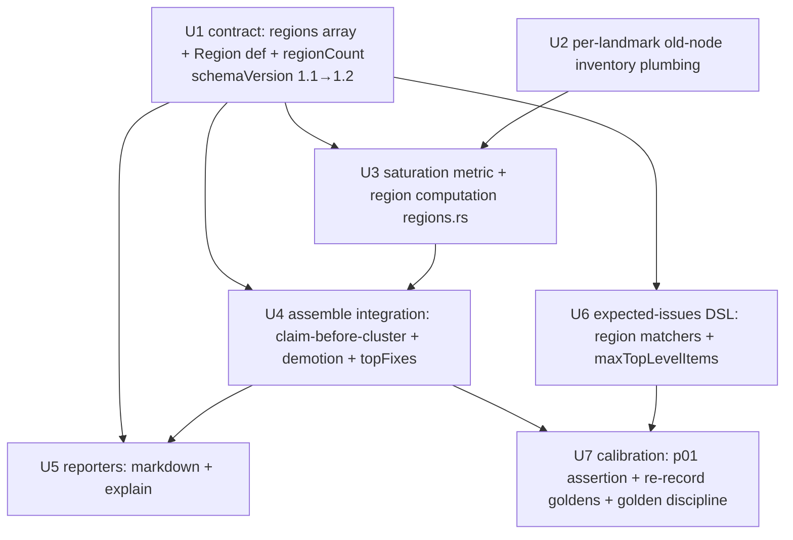

# feat: Region-saturation rollup in the analyze layer

## Summary

Add a deterministic **region-saturation rollup** to matchy's analyze layer: a new additive top-level `regions` array in `DiffResult`. When an ARIA-landmark region's *structural* damage crosses a frozen threshold, matchy emits one region-level finding and demotes that region's member issues to drill-down — so a consuming agent sees the footer as one work item instead of dozens. The work lands inside the existing `assemble_diff_result` funnel, reusing the clustering / `byLandmark` determinism patterns; the contract bumps `schemaVersion` 1.1→1.2 (Rust serde + JSON schema only), and p01's assertion plus all 21 variant goldens re-record under golden discipline.

---

## Problem Frame

matchy's `DiffResult` is excellent on synthetic single-change fixtures but floods on real migration pairs: the Tier-3 seed `testbed/pairs/p01-hiya-number-registration` produces 272 issues / 25 clusters. Clustering groups by `(landmark × property)` but stops one altitude too low — the footer's damage fragments across multiple landmark and property clusters even though every footer anchor already carries the ARIA `contentinfo` role. The tool *knows* it's the footer but never says so as one finding. Reducing per-page triage burden is a direct lever on migration cost (the number-registration port ran matchy ~10 times across ~75 min of CSS cycles, and that was page 3 of 155). Full motivation, calibration table, and actor/flow analysis live in the origin document (see Sources & References).

---

## Requirements

Traced to the origin document (`docs/brainstorms/2026-06-17-region-saturation-rollup-requirements.md`).

**Saturation metric & trigger**
- R1. Per ARIA landmark, compute a **structural-saturation ratio** = (old-side structural issues anchored to the landmark) / (old-side semantic nodes anchored to the landmark). Style-only churn is excluded from the numerator.
- R2. Emit a region rollup when saturation ≥ **saturation threshold** (frozen `0.6`) **and** the region has ≥ a **minimum old-node count** (frozen `10`). Both are tunable constants, calibrated offline and frozen.
- R3. Metric, thresholds, and emission are fully deterministic in the analyze layer (spec §3.3 / §15): byte-identical bundles → byte-identical `regions`; no map-iteration-order dependence; total-ordered tie-breaks; fixed-order float reductions. No LLM/inference.

**Region object & output shape**
- R4. `DiffResult` gains a top-level `regions` array, distinct from `clusters`. Each rollup carries: landmark, saturation ratio with numerator/denominator evidence, member issue IDs, severity, and a human-readable summary.
- R5. Each rollup's `id` is derived from the **landmark** (ordinal-independent), not a hash of member issue IDs — so it survives re-captures while per-issue IDs churn.
- R6. A saturated region **claims all issues anchored to it** (structural + style). Claimed issues are demoted: they remain in `issues` for drill-down but are no longer independent line-items in `clusters` / `topFixes`.
- R7. `regions` is **purely additive**: schema versioned additively; when no region saturates, `regions` is empty and all other output is unchanged.

**Consumer-facing summary**
- R8. `agentSummary` leads with the highest-altitude work first — region rollups and standalone real defects ahead of the long tail. `topFixes` may reference region ids; a region count is exposed.
- R9. A standalone real defect is **never silently swallowed**: a defect outside any saturated region stays top-level, and a critical-severity member inside a saturated region remains individually reachable.

**Calibration fixture**
- R10. p01's `expected-issues.json` evolves from a raw `maxIssues` cap to a **top-level-work-item assertion**: ≤ N top-level items (standalone issues + clusters + region rollups), exactly one of which is a `contentinfo` rollup at saturation ≥ threshold, with the `broken_link` true-positive still asserted and unswallowed.
- R11. Region-rollup assertions reuse the existing `expected-issues` matcher vocabulary; no second matcher implementation (`check-pair.py` keeps importing `check-fixture.py`'s engine).

**Origin actors:** A1 (consuming coding agent — primary optimization target), A2 (human migration-QA reviewer), A3 (matchy analyze layer — deterministic emitter).
**Origin flows:** F1 (region-aware migration triage — covered by R4, R6, R8, R9).
**Origin acceptance examples:** AE1 (R1, R2 — contentinfo rolls up, main does not), AE2 (R2 — banner below node count), AE3 (R6 — footer style issues leave global property clusters), AE4 (R7 — single-change variant byte-identical apart from empty `regions`), AE5 (R9 — broken_link in unsaturated `main` stays top-level).

---

## Scope Boundaries

Carried from origin — these are firm non-goals for this plan:

- **Not** fixing the issue-ID-stability bug (only 2/129 ids survived a re-run on p01). The region key (R5) is deliberately designed not to depend on it. See `[[matchy-issue-id-instability]]` (separate track).
- **No** consumer-side LLM reranking ("is the footer in scope for *my* task?"). The tool emits neutral deterministic rollups only.
- **No** new detection capability — this aggregates existing detections; it is not a G1–G8 detection goal.
- **No** rollup for the no-landmark `(none)` chrome tail (notification bar, Weglot). Those ~6 issues stay individual; landmark-keyed rollups cannot capture them. (Doubly excluded on p01: `(none)` also has only 7 nodes, below the 10 floor.)
- **Not** re-litigating the M9 Tier-3 milestone.
- **Not** changing or depending on the separate `extract-webflow-styles.sh` styleCompare tool or its per-selector ledger.

### Deferred to Follow-Up Work

- **Second-page calibration fixture** (home / branded-call): capturing a second real pair to re-confirm the 0.88-vs-0.02 separation is a follow-up Tier-3 fixture, not part of this plan. Constants stay frozen at the p01-validated values; this plan validates them against the *recorded* p01 run (see Key Technical Decisions). A live second-page capture is execution-time work outside this PR.
- **HTML reporter rendering of regions** (`report/html.rs`): the human-QA surface (A2) is served by the markdown reporter and `matchy explain` in U5; equivalent HTML rendering is a low-value follow-up unless a consumer needs it.

---

## Context & Research

### Relevant Code and Patterns

- **`packages/analyze/src/report/json.rs` → `assemble_diff_result()`** — the single assembly funnel (called by both `run_analyze` and `run_full` in `bin/matchy.rs`). Its numbered stages (merge → baseline → scope → sort → cluster → by_type → fixable → topFixes → counts → scores) are where the region step inserts. `compute_by_landmark()` here is the parallel per-landmark grouping to mirror.
- **`packages/analyze/src/clustering.rs` → `cluster_issues()`** — two-pass `(IssueType, property)` then `(IssueType, landmark)` grouping with a `claimed_ids: BTreeSet` that removes an issue from later passes (each issue in ≤1 cluster). The region claim extends exactly this pre-claim mechanism. Cluster id = `cluster_` + 12 hex of `sha256("{type}\x1f{kind}\x1f{shared_key}")`.
- **`packages/analyze/src/contract.rs`** — `DiffResult` (add `regions`), `AgentSummary` (add `regionCount`), `Scores`/`LandmarkScores`, `IssueSeverity` (`.rank()` 0–3: info/warning/error/critical), `IssueType` (45-value enum), `IssueCategory`. `to_json` is pretty-printed + trailing newline.
- **`packages/analyze/src/issue.rs` → `compute_issue_id()`** — the content-addressed id pattern (`sha256` → first 12 hex) to mirror for the region id, but keyed on landmark only (R5).
- **`packages/analyze/src/scoring.rs`** — `severity_for()`, `fix_value()` (severity.weight × confidence × anchor_strength). Per-type overrides make `load_error` / `status_code_mismatch` / `missing_form` Critical.
- **Determinism toolkit** (spec §3.3/§15, grep-verified): `BTreeMap`/`BTreeSet` throughout, `collect`-then-`sort` member-id vecs, total-order tie-breaks ending `.then_with(|| a.id.cmp(&b.id))`, `fold(f64::INFINITY, f64::min)` fixed-order reductions.
- **`contract/diff-result.schema.json`** — `schemaVersion` enum `["1.1"]`, `additionalProperties: false`, exhaustive 18-key `required` array. Adding `regions` forces the enum bump + `required`/`properties` addition; serde struct and schema must change together or the in-crate `jsonschema` round-trip test fails.
- **`testbed/check-fixture.py`** — matcher DSL engine. Existing vocabulary: `type`/`anyOfTypes`, `goal`, `anchors.{textContains,hrefContains,nearestHeadingContains,altContains,landmark,role}`, `evidence.{property,fromContains,toContains,oldContains,newContains}`, `minSeverity`/`maxSeverity`, `maxIssues`, and a `clusters.required[]` spec with `sharedProperty`/`sharedLandmark`/`minMembers`/`exactlyOne`/`memberType`. The region spec extends this shape (R11). `testbed/check-pair.py` imports this engine via `importlib`.
- **`testbed/compare-golden.py`** — float abs tolerance `1e-4`, excluded keys `{runId, capturedAt}`, arrays order/length-exact. Adding an empty `regions` key is a new key in all 21 goldens.

### Institutional Learnings

- **`docs/bugs/ROOT-CAUSE-AND-PLAN.md` (root cause 4 / WP-E)** — this feature's thesis: the aggregation model ignored the structural/landmark dimension the data already carries. WP-E shipped `scores.byLandmark` as a single additive `schemaVersion` bump with one end-of-feature golden re-record + changelog + auditor verdict. Mirror that: one `1.1→1.2` bump, one re-record pass.
- **`docs/design/M8.md`** — the deterministic landmark-clustering template (`BTreeMap<(IssueType, landmark), Vec<id>>`, one bucket per group, at-most-one-bucket partition). The region rollup is the same shape with a saturation gate instead of a count gate.
- **`docs/bugs/p0-02-issue-ids-unstable-across-runs.md`** — ids drifted because the hash incorporated nondeterministic tracking params. Directly motivates R5: hash the region id from the landmark role **only** — never member ids, node counts, or the ratio (all churn run-to-run).
- **`docs/design/M3.md`** — `anchors.landmark` (banner/navigation/main/contentinfo/complementary/form) and `ordinalInLandmark` already define per-landmark indexing; the denominator reuses this taxonomy rather than inventing a parallel node count. Note the chrome landmarks (banner/nav/contentinfo) carry a `CHROME_PENALTY` elsewhere — relevant context for why a gutted shared footer is the canonical rollup case.
- **`docs/bugs/p1-03-run-to-run-variance.md` / `p1-04-weak-pairing-style-noise.md`** — real-page issue counts swing 116–155 run-to-run and many style pairings are uncertain. Bears on numerator stability; the structural numerator (missing/broken) is the most stable issue class, which reinforces the structural-by-node choice.

### External References

None — internal deterministic-algorithm change with abundant direct local patterns (clustering, `byLandmark`, content-addressed ids, golden discipline, matcher DSL). External research skipped per planning.

---

## Key Technical Decisions

- **Structural numerator is a type allowlist, not `category == Structure`.** Only `component_reordered`/`component_swapped` carry `IssueCategory::Structure`; the `missing_*` and `broken_*` types are `IssueCategory::Content`. So R1's numerator must enumerate issue *types*: `missing_*` (title, h1, text, link, image, form, form_field, submit, button, alt_text, meta_description), `broken_link`, `broken_image`, `heading_structure_changed`, `component_reordered`, `component_swapped`. A category filter would silently miss the entire missing-node class.
- **Numerator is operationalized as a *count of structural issues*, realizing origin R1's "missing/broken/structurally-changed nodes."** Origin R1 phrases the numerator in *nodes*; the plan counts *issues* because each `missing_*` maps 1:1 to a lost old node, so issue-count faithfully realizes node-loss for the dominant case (verified on p01: contentinfo's 44 issues are all `missing_*`). Two issue types break the 1:1 mapping and need an explicit guard (see Open Questions → resolved, and U3): `broken_link`/`broken_image` are *new-side* failures (the old node still exists, `seqIndexOld: null`), so they have no entry in the old-node denominator and a small landmark with a burst of broken-resource issues could push the raw ratio above 1.0. The metric therefore **clamps `saturation` to `[0,1]`** and uses `denominator = max(oldNodeCount, structuralCount)` so a broken-resource burst can never spuriously saturate a region whose old nodes are largely intact; the `oldNodeCount ≥ 10` floor still uses the raw old-node count. On p01 this changes nothing (main's single `broken_link` keeps it at 1/60 = 0.02). *(Calibration note: the origin table shows contentinfo at 45 structural / 0.88; the frozen recorded run gives 44 / 0.86 — the difference is the `changed_link_*` exclusion below; the plan uses the recorded-run value 44.)*
- **Exclude `changed_link_target` / `changed_link_text` from the numerator** (resolves origin's deferred R1 question). Structural = node loss/structure, not node modification. Including the `changed_*` link types is what pushed nav/banner to 0.50 in the origin's table; excluding keeps the metric true to "structural-by-node" and `main` at 0.02. Verified against the recorded p01 run: excluding gives nav 0.00 / banner 0.25 (both below the 10-node floor anyway), so the one-rollup outcome holds either way — excluding is the more principled and generalizable choice.
- **Severity floor for *additional* standalone surfacing = `critical`** (resolves origin's deferred R9 question). Grounded in the recorded p01 run: all 44 footer structural members are `error` severity, so an `error` floor would re-surface all 44 and defeat the rollup. Error members fold into the rollup; the rollup carries **worst-member severity** (= `error` on p01) so it stays high-priority; members remain reachable via `memberIssueIds` drill-down. Only `critical` members (load_error / status_code_mismatch / missing_form) additionally get a standalone `topFixes` entry. Defects *outside* a saturated region (the broken_link in `main`) are never claimed regardless (AE5).
  - **This deliberately reinterprets origin R9's "error/critical … remains individually reachable."** For `error`-and-below in-region members, "individually reachable" is satisfied by enumeration in the rollup's `memberIssueIds` (drill-down) plus the rollup carrying worst-member severity — **not** by a standalone `topFixes` entry. The consumer contract: an agent triaging `topFixes` (top 5) sees the region as an `error`-severity work item and drills into its members; it does not receive each footer error as its own line. Only `critical` members are dual-surfaced standalone. This narrowing is what makes the rollup actually reduce noise on p01; because it relaxes R9's literal "error/critical" wording, **U7's golden-changelog entry must record it explicitly** so the origin-fidelity divergence is auditable.
- **Region claims members *before* clustering** (resolves origin's deferred R6 precedence question). Compute regions on the sorted kept set, collect the claimed ids, then pass them as pre-claimed into `cluster_issues` so property and landmark clusters form only from unclaimed issues. The footer's style issues therefore leave the global color/display property clusters and fold into the one rollup (AE3); those clusters shrink for their non-footer members.
- **Region severity = worst-member severity; `regions` and `scores.byLandmark` stay independent.** Saturation-derived severity was considered but worst-member is what an agent acts on. `byLandmark` (per-landmark 1/(1+n) scores for *all* landmarks) is unchanged and complementary — `regions` is the saturated subset with rollup semantics; they share only the landmark key. No coupling.
- **Region id keyed on landmark only** (R5): `region_` + 12 hex of `sha256("region\x1f{landmark}")`, mirroring the cluster-id format with a `region` discriminator. Ordinal-independent and stable across re-captures; deliberately decoupled from the member-id churn bug.
- **Saturation computed at the merged assemble altitude.** Numerator = merged kept structural issues anchored to the landmark; denominator = old-side nodes per landmark summed across analyzed viewports. This matches where `clusters`/`topFixes`/`byLandmark` already operate. The summed ratio is a **node-weighted mean** across viewports: it is ratio-preserving only when breakage is *per-viewport-uniform*. When a landmark is gutted on one viewport but intact on another, the merged ratio dilutes the single-viewport damage and could fall below `0.6` (suppress a real gutting) or be dragged over it. The exact multi-viewport semantics — emit-if-any-viewport-saturates vs. keep the merged mean — is a **deferred decision** (see Open Questions); per-viewport numerator/denominator should be retained as evidence either way. p01 is single-viewport (`desktop/` only), so the merged ratio is exact for the calibration target and the dilution case is unreachable until a multi-viewport real pair lands.
- **Constants frozen at p01-validated `0.6` / `10`.** Validated against the recorded run: contentinfo 51 nodes / 44 structural = 0.86 ≥ 0.6 (rolls up); main 60 / 1 = 0.02 (does not); banner 4 nodes and nav 8 nodes below the 10 floor (AE2). Exactly one rollup.
- **One additive contract bump (`schemaVersion` 1.1→1.2), Rust-only.** `DiffResult` is produced and validated on the Rust side; the zod layer validates `CaptureBundle`, which this plan does not touch. Add `regions` to `properties` + `required`, bump the enum, update the description, keep serde struct and schema in lockstep. One end-of-feature golden re-record under golden discipline (WP-E precedent).

---

## Open Questions

### Resolved During Planning

- **(R1) Structural numerator definition** → type allowlist, excluding `changed_link_*` (see Key Technical Decisions).
- **(R1) Numerator units (origin says "nodes"; plan counts "issues")** → count structural issues as the operationalization of node-loss (1:1 for `missing_*`); guard the non-1:1 `broken_*` (new-side) case with `denominator = max(oldNodeCount, structuralCount)` and a `[0,1]` clamp so the ratio stays well-defined.
- **(R6) Region-claim vs cluster precedence** → claim before clustering; clusters recompute from the unclaimed pool.
- **(R4) Region severity/status derivation & relation to `scores.byLandmark`** → severity = worst member; no separate status field; `byLandmark` unchanged and independent.
- **(R9) Severity floor for un-demoted members** → `critical` (data-grounded; `error` would defeat the rollup on p01).
- **(R2) Constant validation** → 0.6/10 validated against the recorded p01 run; exactly one rollup (contentinfo).

### Deferred to Implementation

- **Exact `N` for p01's `maxTopLevelItems` assertion (R10).** N = standalone-issues-not-in-any-cluster-or-region + clusters + regions after the claim/recompute lands. The recorded baseline is 272 issues / 25 clusters; N is computed from the post-implementation run and written into p01's expectation in U7 (golden-discipline change). The assertion *shape* is fixed now; the integer is filled during implementation.
- **Final region `summary` wording.** Built from the fixed landmark-role vocabulary only (no page-derived strings — HTML-escape safety per M8). Exact phrasing settled in U3.
- **Whether any `topFixes` ordering tweak is needed beyond inserting regions into the existing fix-value work queue.** Expected to be none — regions slot in as work-queue entries keyed by max member `fix_value` — but confirmed once U4's integration test runs.
- **Multi-viewport region emit semantics.** Whether a landmark gutted on one viewport but intact on another should emit per-most-damaged-viewport, per-viewport regions, or keep the merged node-weighted mean. Deferred because p01 is single-viewport and the choice cannot be calibrated until a multi-viewport real pair lands; per-viewport numerator/denominator should be retained as evidence so the decision is data-driven when it arrives.

---

## High-Level Technical Design

> *This illustrates the intended approach and is directional guidance for review, not implementation specification. The implementing agent should treat it as context, not code to reproduce.*

**Region object shape** (additive to `DiffResult`):

```
Region {
  id:              string   // "region_" + sha12("region\x1f" + landmark) — landmark-derived (R5)
  landmark:        string    // "contentinfo" | "main" | "navigation" | ...
  saturation:      number    // structuralCount / oldNodeCount, clamped to [0,1]
  structuralCount: integer   // numerator evidence (R4)
  oldNodeCount:    integer   // denominator evidence (R4)
  memberIssueIds:  [string]  // ALL issues anchored to the landmark, sorted asc (R6 drill-down)
  severity:        enum      // info|warning|error|critical — worst member (R4)
  summary:         string    // from the fixed landmark-role vocabulary only
}

DiffResult.regions:        [Region]   // required; empty when nothing saturates (R7)
AgentSummary.regionCount:  integer    // exposed count (R8)
```

**`assemble_diff_result` pipeline with the new stage 3b inserted** (existing stage numbers preserved):

```
1.  merge issues across viewports
2.  baseline suppression
2b. --scope partition
3.  sort kept by (fix_value DESC, id ASC)
3b. NEW → compute_regions(kept, summed_old_landmark_node_counts, {0.6, 10})
        ├─ group kept structural issues by landmark (BTreeMap)
        ├─ ratio = structuralCount / oldNodeCount; emit iff ratio ≥ 0.6 AND oldNodeCount ≥ 10 AND landmark ∈ real-landmarks
        ├─ region.memberIssueIds = ALL kept issues anchored to landmark (sorted)
        └─ region_claimed_ids = ⋃ members of emitted regions
4.  cluster_issues(kept, CLUSTER_MIN, pre_claimed = region_claimed_ids)   // clusters form from unclaimed only
5.  by_type
6.  fixable_now
7.  topFixes work queue:
        one entry per region   (fv = max member fix_value)
      + one entry per cluster   (fv = max member fix_value)
      + one entry per kept issue in NO region and NO cluster
      + one entry per CRITICAL member inside a saturated region   // R9 safety net
        → sort (fv DESC, id ASC), take 5
8.  cluster_count + regionCount
... (unchanged: scores incl. byLandmark, status, determinism, artifacts, warnings, assemble)
```

The denominator (`summed_old_landmark_node_counts`) is computed once per viewport in `analyze_viewport` from `old.page.nodes` and summed in the funnel (U2), keeping `assemble_diff_result` a pure function of its inputs.

---

## Implementation Units



### U1. Contract: additive `regions` array, `Region` def, `regionCount`, schemaVersion bump

**Goal:** Land the additive contract shape so downstream units have a stable target: `DiffResult.regions: [Region]`, `AgentSummary.regionCount`, the `Region` `$def`/struct, and `schemaVersion` 1.1→1.2 — serde and JSON schema in lockstep.

**Requirements:** R4, R5 (id shape), R7 (additive/required-but-empty)

**Dependencies:** None

**Files:**
- Modify: `contract/diff-result.schema.json` (add `Region` `$def`; add `regions` to `properties` + `required`; add `regionCount` to the `agentSummary` def; bump `schemaVersion` enum `["1.1"]`→`["1.2"]` and update its description)
- Modify: `packages/analyze/src/contract.rs` (`struct Region`, `DiffResult.regions: Vec<Region>`, `AgentSummary.region_count: u32`, set version string to `"1.2"`)
- Test: `packages/analyze/src/contract.rs` inline `#[cfg(test)] mod tests` (serde round-trip) + extend the in-crate `jsonschema` validation test sites (`packages/analyze/src/semantic_diff.rs`, `packages/analyze/src/hygiene.rs`)

**Approach:**
- `Region` fields per the High-Level design; `#[serde(rename_all = "camelCase")]` to match the schema. `memberIssueIds` is `Vec<String>`.
- `regions` is **required** in the schema (mirrors the 1.1 precedent that made new fields required so the version boundary stays crisp); empty array is valid and is the no-saturation default (R7).
- `additionalProperties: false` means the struct and schema must agree exactly — add the field to both in this unit.
- Population is U3/U4's job; this unit emits `regions: []` and `regionCount: 0` so the round-trip/validation tests pass.

**Patterns to follow:** the `Cluster` def/struct (id + issueIds + summary shape); the `1.0→1.1` additive-bump precedent described in the schema `description` and `docs/bugs/ROOT-CAUSE-AND-PLAN.md` WP-E.

**Test scenarios:**
- Happy path: a `DiffResult` with `regions: []` and `regionCount: 0` serializes and validates against the 1.2 schema (`schemaVersion: "1.2"`). Covers AE4 (empty-regions additive shape).
- Happy path: a `DiffResult` carrying one populated `Region` (all fields) round-trips serde and validates against the schema.
- Edge case: a region id matches the schema pattern (if a `^region_[0-9a-f]{12}$` pattern is added) and `saturation` within `[0,1]` validates; out-of-range `saturation` (e.g. 1.5) fails validation.
- Error path: a document with `schemaVersion: "1.1"` (missing `regions`) fails validation against the bumped schema — confirms the version boundary is crisp.

**Verification:** `cargo test` passes including the serde round-trip and `jsonschema` validation; the schema and serde struct agree (no `additionalProperties` rejection).

---

### U2. Per-landmark old-node inventory plumbing

**Goal:** Make the saturation denominator — old-side semantic nodes per landmark — available to the assembly funnel without threading the raw bundle into `assemble_diff_result`.

**Requirements:** R1 (denominator), R3 (determinism)

**Dependencies:** None

**Files:**
- Modify: `packages/analyze/src/lib.rs` (`analyze_viewport`: compute the per-landmark old-node count from `old.page.nodes`; return it via the function's result tuple — currently `(Vec<Issue>, Scores)` — since `analyze_viewport` does **not** build a `ViewportAnalysis` itself; the caller does)
- Modify: `packages/analyze/src/report/json.rs` (`ViewportAnalysis` struct: add `old_landmark_node_counts: BTreeMap<String, u32>`)
- Modify: `packages/analyze/src/bin/matchy.rs` (all three `ViewportAnalysis` construction sites must populate the new field — `run_analyze`, the full-run path, and the **load-error placeholder** path, which has no old bundle and therefore sets an empty `BTreeMap`)
- Test: `packages/analyze/src/lib.rs` inline `#[cfg(test)] mod tests`

**Approach:**
- Iterate `old.page.nodes`, group by `anchors.landmark` into a `BTreeMap<String, u32>` (deterministic order). `None` landmark → key `"(none)"`, consistent with `compute_by_landmark`.
- `analyze_viewport` returns the count in its result tuple; the caller in `bin/matchy.rs` attaches it to the `ViewportAnalysis` it constructs (the struct is defined in `report/json.rs`). All three construction sites must set the field or the crate will not compile; the load-error site sets an empty map.
- The funnel sums these maps across viewports into one `BTreeMap<String, u32>` for the region computation (U3 consumes it).
- No behavior change to issues/scores in this unit — pure data plumbing.

**Patterns to follow:** the `BTreeMap` grouping idiom in `compute_by_landmark()` (`report/json.rs`); `IntegrityCounts.landmark_count` shows the existing total-count primitive (this adds the per-landmark breakdown).

**Test scenarios:**
- Happy path: a synthetic old bundle with known landmark distribution (e.g. 51 contentinfo, 60 main, 7 none) yields the exact per-landmark `BTreeMap`.
- Edge case: nodes with `null` landmark are bucketed under `"(none)"`, not dropped.
- Edge case: a landmark with zero nodes does not appear as a key (no zero entries).
- Integration: summing two viewport maps for the same landmark adds the counts (verifies the funnel's cross-viewport sum).

**Verification:** the per-landmark counts for the frozen p01 old bundle match `{banner:4, navigation:8, "(none)":7, main:60, contentinfo:51}`.

---

### U3. Saturation metric + region computation module

**Goal:** A pure, deterministic `regions` module that computes structural saturation per landmark and emits `Region` rollups at the frozen thresholds.

**Requirements:** R1, R2, R3, R4, R5

**Dependencies:** U1 (`Region` struct), U2 (old-node counts)

**Files:**
- Create: `packages/analyze/src/regions.rs` (`compute_regions(kept: &[Issue], old_landmark_node_counts: &BTreeMap<String,u32>) -> Vec<Region>`; the structural-type allowlist constant; `SATURATION_THRESHOLD = 0.6`, `MIN_NODE_COUNT = 10` frozen consts with a calibration comment)
- Modify: `packages/analyze/src/lib.rs` (`mod regions;`)
- Test: `packages/analyze/src/regions.rs` inline `#[cfg(test)] mod tests`

**Approach:**
- Structural allowlist (numerator): `missing_*` (title/h1/text/link/image/form/form_field/submit/button/alt_text/meta_description), `broken_link`, `broken_image`, `heading_structure_changed`, `component_reordered`, `component_swapped`. **Excludes** `changed_link_target`/`changed_link_text` and all style/content-modification/hygiene/technical/a11y types.
- Per real landmark: numerator = count of kept structural issues anchored there; `denominator = max(old_landmark_node_counts[landmark], numerator)`; `saturation = numerator / denominator`, clamped to `[0,1]`. The `max(…)` keeps the ratio well-defined when new-side `broken_link`/`broken_image` issues (no corresponding old node) outnumber the landmark's old nodes, so a broken-resource burst cannot spuriously saturate a region whose old nodes are intact. The `MIN_NODE_COUNT` gate below still tests the **raw** `old_landmark_node_counts[landmark]`, not the `max`. Guard: a landmark with zero old nodes is skipped.
- Emit a `Region` iff `saturation ≥ 0.6` AND `oldNodeCount ≥ 10` AND landmark is a real landmark (exclude `None`/`"(none)"` per scope boundary).
- `memberIssueIds` = ids of **all** kept issues anchored to the landmark (structural + style), sorted ascending.
- `severity` = worst (max `.rank()`) member severity. `id` = `region_` + `sha12("region\x1f" + landmark)`. `summary` from the fixed role vocabulary (e.g. role + structuralCount/oldNodeCount), no page strings.
- Sort the returned `Vec<Region>` by a total order (saturation DESC, then `id` ASC) for byte-stability.

**Execution note:** Implement test-first against AE1/AE2 — the acceptance examples are precise enough to drive the metric.

**Technical design:** see High-Level Technical Design (stage 3b).

**Patterns to follow:** `clustering.rs` (`BTreeMap` grouping, sorted member-id vecs, `sha12` id derivation with a `kind` discriminator, total-order array sort); `issue.rs::compute_issue_id` (hash → first 12 hex), keyed on landmark only here.

**Test scenarios:**
- Happy path: contentinfo with 44 structural over 51 old nodes (0.86) and ≥10 nodes → one region, `severity: error` (worst member), members include both structural and style issues, sorted. Covers AE1.
- Happy path: main with 1 structural over 60 nodes (0.02) → no region. Covers AE1.
- Edge case: banner at high saturation but only 4 old nodes → no region (below `MIN_NODE_COUNT`). Covers AE2.
- Edge case: a landmark exactly at saturation 0.6 with exactly 10 nodes → emitted (boundary inclusive); 0.59 or 9 nodes → not emitted.
- Edge case: `changed_link_target` issues anchored to a landmark do **not** count toward the numerator (verifies the exclusion decision).
- Edge case: `None`/`"(none)"` landmark never produces a region even at saturation 1.0 with ≥10 nodes.
- Edge case: denominator of 0 (landmark with issues but no old nodes) is skipped without panic.
- Edge case: a landmark with 11 old nodes and 15 `broken_link` issues (new-side, no old node) yields `saturation` clamped to 1.0 via `max(11,15)` rather than 15/11 = 1.36; confirms a broken-resource burst does not produce an out-of-range ratio, and that this case still gates on the raw old-node count.
- Determinism: identical input (in any pre-sort order) → byte-identical `Vec<Region>` (ids, order, member order).

**Verification:** unit tests for AE1/AE2 pass; a region's id is reproducible from its landmark alone (re-running with shuffled member ids yields the same region id).

---

### U4. Assemble integration — claim-before-cluster, demotion, topFixes, regionCount

**Goal:** Wire regions into `assemble_diff_result`: compute regions, claim members before clustering, demote claimed members from clusters/`topFixes`, surface regions in `topFixes` with the critical-member safety net, and populate `regionCount`.

**Requirements:** R6, R8, R9

**Dependencies:** U1, U3

**Files:**
- Modify: `packages/analyze/src/report/json.rs` (`assemble_diff_result`: new stage 3b; sum the U2 per-viewport counts; pass `region_claimed_ids` to clustering; extend the `topFixes` work queue; set `region_count`; populate `DiffResult.regions`)
- Modify: `packages/analyze/src/clustering.rs` (`cluster_issues` gains a `pre_claimed: &BTreeSet<String>` parameter seeding `claimed_ids`)
- Test: `packages/analyze/tests/` integration test replaying the frozen p01 bundles; inline tests in `report/json.rs`

**Approach:**
- Stage 3b (after the existing sort): `regions = compute_regions(&kept, &summed_old_counts)`; `region_claimed_ids = regions.flat_map(memberIssueIds)`.
- Pass `region_claimed_ids` as `pre_claimed` into `cluster_issues` so property (Pass 1) and landmark (Pass 2) clusters form only from unclaimed issues — footer style issues leave the global color/display clusters (AE3); those clusters shrink for non-footer members.
- `topFixes` work queue (extends the existing cluster-aware queue): one entry per region (fv = max member `fix_value`) + one per cluster + one per kept issue in no region and no cluster + one per **critical**-severity member inside a saturated region (R9). Sort `(fv DESC, id ASC)`, take 5. Region ids now appear in `topFixes`.
- A defect outside any saturated region is never claimed and flows through the queue as today (AE5).
- `agentSummary.regionCount = regions.len()`; `clusterCount` semantics unchanged.

**Technical design:** see High-Level Technical Design (stages 3b/4/7).

**Patterns to follow:** the existing `claimed_ids: BTreeSet` pre-claim mechanism in `clustering.rs`; the existing `topFixes` work-queue construction in `report/json.rs` (one entry per cluster + one per unclustered issue).

**Test scenarios:**
- Integration (p01 replay): exactly one region (`contentinfo`) is emitted; the `broken_link` in `main` remains a top-level work item (in `topFixes` or as an unclustered issue), not swallowed. Covers AE5.
- Integration (p01 replay): the footer's `style_changed` issues are absent from the global `display`/`color` property clusters and present in the contentinfo region's `memberIssueIds`; those property clusters shrink accordingly. Covers AE3.
- Happy path: a saturated region's id appears in `topFixes`; the region's members (below critical) do not appear as separate `topFixes` entries.
- Edge case (R9 safety net): a synthetic critical-severity member (e.g. `missing_form`) inside a saturated region appears as its own `topFixes` entry *and* in the region's `memberIssueIds`.
- Edge case: when no region saturates, `topFixes`/`clusters`/`byType` are byte-identical to pre-change output and `regionCount == 0`. Covers AE4.
- Edge case: a kept issue claimed by a region is excluded from `clusterCount` accounting but still present in the global `issues` array (R6 drill-down).

**Verification:** the frozen p01 replay yields one `contentinfo` rollup with broken_link unswallowed; a single-change variant (e.g. v03) shows no behavioral change beyond `regions: []` / `regionCount: 0`.

---

### U5. Surface regions in the markdown reporter and `matchy explain`

**Goal:** Make the new top-level array visible to the human-QA reviewer (A2): render region rollups in the markdown report and in `matchy explain`, leading with region-altitude work (R8).

**Requirements:** R8

**Dependencies:** U1, U4

**Files:**
- Modify: `packages/analyze/src/report/markdown.rs` (render a region rollup section ahead of the per-landmark issue tail; show landmark, saturation `structuralCount/oldNodeCount`, severity, member count)
- Modify: `packages/analyze/src/explain.rs` (or the explain path in `bin/matchy.rs`) to mention region rollups
- Test: `packages/analyze/src/report/markdown.rs` inline `#[cfg(test)] mod tests`

**Approach:**
- Markdown: a region rollup renders as one summary line/section ("`contentinfo` region — 44/51 structural (0.86), 88 issues claimed, severity error") with a drill-down to member ids, ahead of the long per-landmark tail. Reuse the existing `BTreeMap<(landmark, nearestHeading), …>` grouping idiom in the reporter.
- `explain`: surface region count and the rollups in the human-readable explanation.
- HTML rendering is deferred (see Scope Boundaries).

**Patterns to follow:** existing landmark/section grouping in `report/markdown.rs` (`docs/bugs/p2-10-report-md-grouping.md`).

**Test scenarios:**
- Happy path: a `DiffResult` with one region renders a region section in the markdown with the landmark, saturation, and claimed-issue count; members are reachable.
- Edge case: `regions: []` renders no region section and the markdown is otherwise unchanged.
- Happy path: `matchy explain` output names the region count when ≥1 region is present.

**Verification:** golden/snapshot of the markdown for a region-bearing fixture shows the rollup leading the issue tail; empty-regions output is unchanged.

---

### U6. Expected-issues DSL — region matchers + top-level-work-item assertion

**Goal:** Extend the matcher engine so fixtures can assert region rollups and a top-level work-item budget, reusing the existing vocabulary (R11).

**Requirements:** R10 (assertion mechanism), R11 (single engine)

**Dependencies:** U1 (region output shape)

**Files:**
- Modify: `testbed/check-fixture.py` (a `regions.required[]` spec analogous to `clusters.required[]`: match by `landmark`, `minSaturation`, `exactlyOne`, optionally `memberIncludesType`; a `maxTopLevelItems` assertion = count of standalone-issues-not-in-any-region-or-cluster + clusters + regions)
- Modify: `testbed/schemas/expected-issues.schema.json` (add the `regions` spec and `maxTopLevelItems`)
- Test: `testbed/tests/` (DSL unit coverage for the new matchers)

**Approach:**
- The `regions` spec mirrors the `clusters` matcher shape (`exactlyOne`, key match) so the engine has one implementation path (R11). `minSaturation` compares the region's `saturation` field with a float tolerance consistent with `compare-golden.py`.
- `maxTopLevelItems` computes the top-level count from the emitted `DiffResult` (issues not referenced by any region `memberIssueIds` or cluster `issueIds`, plus `len(clusters)` plus `len(regions)`).
- `check-pair.py` continues to import this engine unchanged (R11).

**Patterns to follow:** the existing `clusters.required[]` matcher (`sharedProperty`/`sharedLandmark`/`minMembers`/`exactlyOne`) and `maxIssues` handling in `check-fixture.py`.

**Test scenarios:**
- Happy path: a `regions.required[{landmark: contentinfo, minSaturation: 0.6, exactlyOne: true}]` matcher passes against a `DiffResult` with exactly one contentinfo region at 0.86, fails when zero or two match.
- Happy path: `maxTopLevelItems: N` passes when the computed top-level count ≤ N, fails when over.
- Edge case: a region member issue is not double-counted as a standalone top-level item.
- Edge case: `minSaturation` boundary (region at exactly the threshold passes).

**Verification:** the DSL unit tests pass; running the existing v01–v21 fixtures through the engine is unaffected (no fixture uses the new keys yet).

---

### U7. Calibration — p01 assertion (R10) + re-record goldens (R7/AE4), under golden discipline

**Goal:** Evolve p01's expectation to the top-level-work-item assertion and re-record all goldens to carry the additive `regions` field — with the required changelog entry and `golden-auditor` APPROVE.

**Requirements:** R7, R10, AE4

**Dependencies:** U4 (regions in output), U6 (matchers)

**Files:**
- Modify: `testbed/pairs/p01-hiya-number-registration/expected-issues.json` (replace `maxIssues: 280` with `maxTopLevelItems: N`; add `regions.required[]` asserting exactly one `contentinfo` rollup at `minSaturation ≥ 0.6`; keep the `broken_link` `required[0]` unchanged and unswallowed)
- Modify: `testbed/goldens/*.diffresult.json` (all 21 variants — add `"regions": []` / `regionCount` where empty; re-record via the recorded run)
- Modify: `docs/golden-changelog.md` (entry: what changed, why the old `maxIssues` expectation was superseded, spec/origin justification; **explicitly record the R9 relaxation** — origin R9's "error/critical … individually reachable" is satisfied for error-and-below members via `memberIssueIds` drill-down rather than standalone surfacing, with critical-only dual-surfacing — so the origin-fidelity divergence is auditable; paste the `golden-auditor` verdict)

**Approach:**
- Determine `N` from the post-U4 p01 run (recorded baseline: 272 issues / 25 clusters; after the contentinfo claim folds ~88 issues into one rollup and the property clusters shrink, the top-level count drops substantially). N is the *measured* post-implementation top-level count plus a small margin, consistent with how `maxIssues` was set to 280 against a 272 run.
- Re-record all 21 variant goldens: AE4 requires they be byte-identical apart from the new empty `regions` field and `regionCount`.
- This touches existing expectations and goldens → **golden discipline applies**: changelog entry + `golden-auditor` APPROVE before commit (per CLAUDE.md and origin Dependencies). Adding the *new* region matchers is not itself a golden change, but changing p01's assertion and re-recording goldens is.

**Execution note:** Golden-discipline change — invoke the `golden-auditor` subagent on the p01 expectation change and the re-recorded goldens, and paste its APPROVE verdict into `docs/golden-changelog.md` before committing. Do not weaken p01's `broken_link` assertion.

**Test scenarios:**
- Integration: `make pair CASE=p01-hiya-number-registration` (the Tier-3 step) passes with the new `maxTopLevelItems` + region assertion and the retained `broken_link` requirement. Covers AE1, AE3, AE5 end-to-end on frozen bundles.
- Integration: `make verify` is green — all 21 variant goldens match (only the additive `regions`/`regionCount` keys differ from prior), and the determinism spot-check holds.
- Edge case: a single-change variant golden (e.g. v03) shows `regions: []` and `regionCount: 0` and is otherwise byte-identical to its pre-change recording. Covers AE4.

**Verification:** `make verify` exits 0; `golden-auditor` APPROVE pasted into `docs/golden-changelog.md`; p01 top-level item count is materially below 272 with exactly one contentinfo rollup and the broken_link still surfaced.

---

## System-Wide Impact

- **Interaction graph:** the only behavioral entry point is `assemble_diff_result` (stage 3b), reached by both `run_analyze` and `run_full`. `cluster_issues` gains a parameter (all callers updated). Reporters (`markdown.rs`, `explain.rs`) read the new field. No new entry points.
- **Error propagation:** `compute_regions` is total (no panics) — denominator-0 and missing-landmark cases are skipped, not errored. The analyze layer stays a pure, infallible function over its inputs (spec §3.3).
- **State lifecycle risks:** none — no persistence, no caching, no concurrency. The risk is *determinism*, addressed via `BTreeMap`/sorted-vec/total-order patterns.
- **API surface parity:** `DiffResult` is the contract surface. The change is additive and Rust-only; the zod/`CaptureBundle` side is untouched. The contract schema (`contract/diff-result.schema.json`) and serde struct must stay in lockstep — both updated in U1. **Note — this diverges from the origin's "validated in both TS zod and Rust serde" dependency:** Phase 1 research confirmed `DiffResult` is produced and validated only on the Rust side (the zod layer in `packages/capture` validates `CaptureBundle`, the *input* contract). No zod/TypeScript file changes for this feature; an implementer should not look for one.
- **Integration coverage:** the p01 frozen-bundle replay (U4/U7) is the cross-layer proof that unit tests alone won't give — it exercises compute → claim → cluster-recompute → topFixes → assertion end-to-end.
- **Unchanged invariants:** `scores.byLandmark`, `clusters` semantics ("same root-cause fix"), issue content-addressing, `suppressed`/`baseline`, and all detection logic (G1–G8) are unchanged. `regions` is a new altitude layered on top, not a replacement. Single-change variants are byte-identical apart from the additive field (AE4).

---

## Risk Analysis & Mitigation

| Risk | Likelihood | Impact | Mitigation |
|------|-----------|--------|------------|
| Severity floor set to `error` would re-surface all 44 footer members and defeat the rollup | — (decided) | High | Floor = `critical`; rollup carries worst-member severity so it stays high-priority. Grounded in the recorded p01 run. |
| Region id instability across re-captures (the p0-02 / `[[matchy-issue-id-instability]]` failure mode) | Low | High | Id hashed from landmark role only (R5) — never member ids, counts, or ratio. Determinism test re-runs with shuffled members and asserts identical id. |
| Numerator using `category == Structure` silently misses the missing-node class | — (caught in research) | High | Type allowlist, not category filter — explicit in U3 with a test asserting `changed_link_*` is excluded and `missing_*` included. |
| Re-recording 21 goldens drifts a golden unintentionally | Medium | Medium | `compare-golden.py` tolerances + `golden-auditor` APPROVE; AE4 test asserts variants are byte-identical apart from the additive field. |
| Chrome landmarks (footer/nav) trip the gate on every page, re-introducing noise | Low–Med | Medium | The `MIN_NODE_COUNT = 10` floor + structural-only numerator gate this; only genuinely gutted regions saturate. Second-page calibration (deferred) is the generalization check. |
| Constants don't generalize beyond p01 | Medium | Medium | Constants are tunable and frozen at p01-validated values; second-page calibration deferred as a validation step, not a blocker (origin decision 2026-06-17). |
| New-side `broken_*` issues (no old node) inflate the numerator past the denominator, spuriously saturating a small landmark | Low | Med | `denominator = max(oldNodeCount, structuralCount)` + clamp `[0,1]`; the `MIN_NODE_COUNT` gate uses the raw old-node count. U3 test asserts the 11-node / 15-broken case clamps to 1.0. Benign on p01 (main's single broken_link → 0.02). |
| Cross-viewport merged ratio dilutes a single-viewport gutting (or is dragged over threshold by one gutted viewport) | Low | Med | The summed ratio is a node-weighted mean — ratio-preserving only under per-viewport-uniform breakage, not in the heterogeneous case. Multi-viewport emit semantics is a deferred decision (Open Questions); per-viewport num/denom retained as evidence. p01 is single-viewport so unreachable for the calibration target. |

---

## Alternative Approaches Considered

- **Extend `clusters` instead of a new `regions` array.** Rejected (origin decision): clusters mean "same root-cause fix"; regions mean "semantic territory." Overloading muddies both and breaks backward-compat assumptions; a separate additive array preserves them.
- **By-issue saturation metric (`tot/oldN`) instead of structural-by-node.** Rejected (origin calibration): by-issue ranks the restyled nav (7.5×) and banner (7.75×) above the gutted footer (1.7×) — it inverts the truth. Structural-by-node separates contentinfo (0.86) from main (0.02) with a wide margin.
- **Saturation-derived region severity.** Rejected in favor of worst-member severity: an agent acts on the worst defect in the region, and worst-member keeps a footer full of `error`s visible as an `error`-severity work item. Saturation is already exposed as evidence.
- **Compute regions per-viewport and merge rollups.** Rejected for the merged-altitude approach: merging same-landmark rollups across viewports is awkward and the merged-set computation (summed num/denom) preserves the ratio while matching where `clusters`/`byLandmark` already operate.

---

## Success Metrics

- On p01, the top-level work-item count drops materially from 272 issues toward a small number (region rollups + remaining clusters + standalone defects), exactly one of which is the `contentinfo` rollup.
- The real `broken_link` defect remains visible at the top, not buried (AE5).
- `main` (restyled) does not roll up; `contentinfo` (gutted) does — the structural-vs-by-issue separation holds.
- Output stays byte-deterministic and golden-stable; single-change variants are unaffected beyond the additive field (AE4).

---

## Documentation / Operational Notes

- `docs/golden-changelog.md` entry + `golden-auditor` APPROVE are mandatory for U7 (touches existing expectations and goldens).
- Update any `DiffResult` contract documentation / README usage note that enumerates top-level fields to include `regions` and `agentSummary.regionCount`.
- No rollout, migration, or monitoring concerns — matchy is a deterministic CLI batch tool.

---

## Sources & References

- **Origin document:** [docs/brainstorms/2026-06-17-region-saturation-rollup-requirements.md](docs/brainstorms/2026-06-17-region-saturation-rollup-requirements.md)
- Authoritative spec: `docs/prds/page-pair-diff-spec.md` (§7 DiffResult, §3.3/§15 determinism, §7.4 migration-loop support)
- Assembly funnel: `packages/analyze/src/report/json.rs` (`assemble_diff_result`, `compute_by_landmark`)
- Clustering precedent: `packages/analyze/src/clustering.rs`; `docs/design/M8.md`
- Contract: `contract/diff-result.schema.json`; `packages/analyze/src/contract.rs`
- Id-stability learning: `docs/bugs/p0-02-issue-ids-unstable-across-runs.md`; aggregation thesis: `docs/bugs/ROOT-CAUSE-AND-PLAN.md` (WP-E)
- Matcher engine: `testbed/check-fixture.py`, `testbed/check-pair.py`; golden compare: `testbed/compare-golden.py`
- Calibration target: `testbed/pairs/p01-hiya-number-registration/` (recorded run: `testbed/.runs/p01-hiya-number-registration/diff-result.json`)
