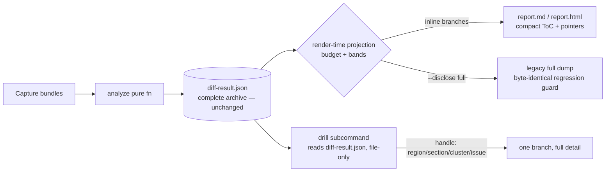
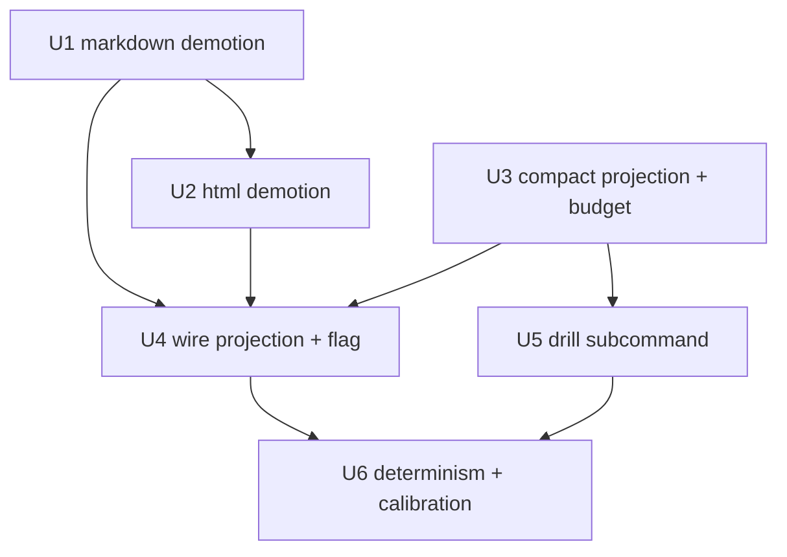

# feat: Agent-First Progressive Disclosure for matchy Output

## Summary

Implement progressive disclosure as a **read-time projection** over the existing `DiffResult` — no contract change. Slice 1 makes the markdown and HTML renderers stop double-reporting region-claimed members (the footer collapses to its existing rollup pointer). Slice 2 adds a pure compact table-of-contents projection bounded by a calibrated budget band, wires it in as the default markdown view (with an opt-in full-output flag), and adds a hermetic read-only drill-down subcommand that expands one branch of an emitted `diff-result.json`.

---

## Problem Frame

The region-saturation rollup shipped the *data* to de-flood real pairs, but the renderers do not honor it: `render_markdown` (`packages/analyze/src/report/markdown.rs:287-423`) walks "Issues by section" over **all** non-uncertain issues and never consults `region.member_issue_ids`, so on the p01 pair the `contentinfo` footer is summarized once in `## Regions` *and* its ~83 member rows are re-dumped below. `render_html` does the same in its issue-card loop. More broadly, output is grouped but still delivered as one flat linear payload with no way to read the high-level shape first and expand only the branch in scope. See origin for the full pain narrative and cost shape (`docs/brainstorms/2026-06-18-progressive-disclosure-report-requirements.md`).

---

## Requirements

- R1. Compact recursive table-of-contents is the first surface a consumer reads, leading with the highest-altitude work (region rollups, per-section counts, standalone real defects, scores).
- R2. First view is bounded by a calibrated size budget, not a hardcoded issue count; depth expands until the budget would be exceeded, below which nodes collapse to a count plus a drill handle.
- R3. Collapse/expand boundary uses bands, not a knife-edge cutoff; output is byte-deterministic on identical bundles and a ±1-issue jitter cannot flip a branch.
- R4. As the queue shrinks across re-runs, the same budget inlines progressively more; below a small total it inlines everything (no drill-down needed).
- R5. Every collapsed node carries a stable, ordinal-independent drill handle (region landmark, `(landmark, nearest-heading)` section key, cluster/issue id).
- R6. Drill-down is a read-only CLI surface that expands one branch hermetically (no browser/network/re-capture) without loading the full result tree.
- R7. No information is lost: every issue present today stays present and reachable; disclosure changes only what is in the first payload.
- R8. Progressive disclosure is a read-time projection over the complete `DiffResult`, not a new required contract field; the JSON archive and its goldens stay byte-identical.
- R9. The compact projection is computed from data already in the output (region rollups, clusters, by-section grouping, `agentSummary`); it adds no detection and no inference (carried verbatim from origin R9).
- R10. Slice 1: markdown + HTML renderers honor the region-rollup demotion (saturated region → one pointer line, not member rows).
- R11. HTML report provides human-facing collapse/expand, collapsed-by-default for large/saturated branches, with no JavaScript (CSP-safe).
- R12. Agent-native parity: any branch a human can expand in HTML, an agent can expand via the CLI, and vice versa.
- R13. A standalone real defect is never swallowed by a rollup; a critical-severity member inside a saturated region stays individually reachable in the compact lead — **exempt from budget collapse and from any top-N truncation**. (Plan-local requirement derived from origin R1 + Success Criteria + AE1; this is the no-swallow guarantee, distinct from origin R9 above.)

**Origin actors:** A1 (consuming coding agent — primary), A2 (human migration-QA reviewer), A3 (matchy analyze/CLI layer)
**Origin flows:** F1 (first-read triage with drill-down — agent), F2 (visual triage — human, HTML)
**Origin acceptance examples:** AE1 (covers R1, R2, R10), AE2 (covers R3), AE3 (covers R4), AE4 (covers R5, R6, R7), AE5 (covers R8)

---

## Scope Boundaries

- No `DiffResult` contract/schema change and no JSON golden re-record — disclosure stays render/CLI-side (R8). Proven by the AE5 guard test.
- No change to the saturation metric, the `0.6`/`10` region constants, or what rolls up — this *consumes* the shipped rollup (`regions.rs`).
- No new detection capability and no consumer-side "is this branch in scope for my task" reranking — the tool stays neutral and deterministic.
- No dependency on cross-run issue-ID stability — handles key on ordinal-independent anchors; per-issue ids are used only within a single run.
- No JavaScript in the HTML report — collapse/expand is CSS-only `
` (spec §2 / M8 §5.1 CSP invariant).

### Deferred to Follow-Up Work

- Optional additive machine-readable outline field in `diff-result.json` for non-CLI consumers: deferred until a JSON consumer demonstrably needs it (would follow the 1.1→1.2 additive-bump ritual: serde + schema in lockstep, all goldens re-recorded under one changelog entry + `golden-auditor` APPROVE).
- Drill-down resolving member anchors down to computed styles (would require loading capture bundles like `explain` does): deferred; v1 prints archive detail only.
- Second-page budget calibration (home / branded-call): deferred validation, not a pre-freeze blocker — mirrors how `0.6`/`10` were frozen on p01.

---

## Context & Research

### Relevant Code and Patterns

- **Markdown renderer** — `packages/analyze/src/report/markdown.rs`: `render_markdown` (`:109`); `## Regions` block already renders a one-line pointer per region (`:268-282`); "Issues by section" walk (`:287-423`); the unfiltered `normal_issues` collection is the slice-1 insertion point (`:290-294`); "By section" count table (`:189-224`); fold-by-`(type,message)` uses a `HashMap` but is determinism-safe via a parallel first-appearance `fold_order: Vec` (`:339-409`).
- **HTML renderer** — `packages/analyze/src/report/html.rs`: `render_html` (`:52`); CSP meta, no-script invariant (`:76`); `## Regions` + bbox overlay already render (`:236-355`); issue-card loop is unfiltered (`:399-509`); existing collapse-by-default `
` for anchors/evidence/remediation (`:469/541/561`); `details` CSS (`:714-717`).
- **Contract model** — `packages/analyze/src/contract.rs`: `DiffResult` (`:439`), `AgentSummary` (`:504`), `Issue` has **no** claimed/demoted flag (`:623`), `Cluster` (`:877`), `Region` with `member_issue_ids` sorted asc (`:894`).
- **Demotion precedent (reuse the shape)** — `packages/analyze/src/report/json.rs`: regions claim before clustering (`:157-168`); the `topFixes` work queue (`:196-258`) is already a budget-bounded TOC of region rollups + clusters + unclaimed standalone issues, with the R9 critical-member dual-surface — the compact projection should mirror this.
- **CLI** — `packages/analyze/src/bin/matchy.rs`: subcommands `Doctor`/`Analyze`/`Explain` + default `run` (`:113-134`); `run_explain` and its required-one-of locator group are the pattern to mirror (`:151-167`, `:577-632`); report-flag wiring in `run_full`/`run_analyze` (`:433-438`, `:734-739`). `explain` (`explain.rs:99`, `format_report` `:300`) is hermetic but reads **capture bundles**, not the result JSON.
- **Determinism + bands** — `packages/analyze/src/config.rs` frozen matcher bands `MATCH_FLOOR=0.70`/`NO_MATCH_CEIL=0.45` (`:126-141`) are the band idiom to copy (do **not** reuse them); `regions.rs` two-gate band `SATURATION_THRESHOLD`/`MIN_NODE_COUNT` (`:24/28`); `scoring.rs::fix_value` is the importance metric for budget ordering.

### Institutional Learnings

- **No report goldens exist.** Only `testbed/goldens/*.diffresult.json` (21 files) are byte-compared (`compare-golden.py`, `1e-4` tol, excludes `runId`/`capturedAt`; `Makefile` verify step 7). `check-fixture.py`/`check-pair.py` compare only `diff-result.json` against `expected-issues.json`. `report.md`/`report.html` are checked only by `check-m8.py:102-126` for presence + required substrings + HTML safety. → Slice 1 touches no golden and needs no `golden-auditor`; only the in-file Rust unit tests + the `check-m8` substrings (`# matchy report`, `## Summary`, `## Scores`, `## Issues`) must be preserved.
- **Issue-ID instability is real and open** (only ~2/129 ids survived a p01 re-run; `docs/bugs/p0-02`). Drill handles must key on landmark / section / cluster, never on cross-run issue-id stability.
- **Determinism toolkit** (`CLAUDE.md` invariants, region-saturation plan): `BTreeMap`/`BTreeSet`, collect-then-sort, total-order tie-breaks ending in `.cmp(&id)`, fixed-order float reductions (`fold(f64::INFINITY, f64::min)`, `total_cmp`). A new map is safe only with a parallel ordered `Vec` (the existing fold pattern).
- **Confidence bands, not cutoffs** (`docs/calibration-note.md` §F5): the validated pattern for R3 — high watermark always-collapse, low watermark always-inline, deterministic structural tie-break in the band.
- **Constant-freeze ritual** (`docs/calibration-note.md` §4, region plan): new constant lives in `config.rs` with a calibration-evidence annotation, calibrated offline against frozen bundles (replay, not capture), exact margins recorded in the changelog, second-page generalization deferred.
- **Run-to-run capture variance** (`docs/bugs/p1-03`): real captures are not byte-stable (counts swung 116–155); only *analyze over frozen bundles* is. Determinism guarantees (R3/AE2/AE5) must be phrased and tested as "byte-identical bundles → byte-identical output," via replay.

### External References

- None — all patterns are local (report renderers, `explain` CLI, determinism scaffolding). External research skipped.

---

## Key Technical Decisions

- **Read-time projection, no contract field (R8).** Storing the TOC in `DiffResult`/`AgentSummary` would ripple into `contract.rs` + `diff-result.schema.json` + all 21 JSON goldens (a `golden-auditor` event). A pure projection avoids all of it; an AE5 guard test proves JSON byte-stability.
- **Default markdown = compact; legacy full dump behind `--full`.** *(user-affirmed call-out)* `--full` is a boolean global flag (default = compact), matching origin's "opt-in full-output flag" framing better than a valued `--disclose full`. Full mode reproduces today's byte output and is regression-guarded so nothing is silently lost; the compact lead prints the literal drill command for each collapsed branch.
- **Drill-down = a new read-only `show` subcommand that reads the emitted `diff-result.json`.** *(user-affirmed call-out)* This corrects the origin's "reuse `explain`'s read path": `explain` reads capture bundles and recomputes. Expanding a branch of an existing result is a genuinely new (still hermetic, file-only) read path; it reuses `explain`'s clap-group + pure-fn + print shape, not its bundle loader. The branch handle is expressed as **separate flags** (`--region <landmark>`, `--section <landmark> --heading <heading>`, `--cluster <id>`, `--issue <id>`) — never a `›`-joined string — so shell-hazardous heading text (spaces, em-dashes, `›`, apostrophes) is carried as ordinary quoted arg values. A `--section` with no `--heading` resolves to all headingless issues in that landmark; this superset is the **defined** R7 contract, not a leak.
- **Slice 1 needs no `golden-auditor`.** *(user-affirmed call-out)* matchy commits no report goldens; reports are substring/safety-checked only. The discipline that remains: keep the four `check-m8` substrings and update the in-file renderer unit tests. **Scoping nuance:** this exception is narrow — it holds because report checks are substring/safety only, *not* content goldens. If a future change removes a required `check-m8` substring (e.g. renames the `## Issues by section` heading) or adds a report content golden, that re-enters the changelog + `golden-auditor` path. Do not generalize "reports need no auditor."
- **Derive the claimed-id set; no new `Issue` flag.** Build a `BTreeSet` from `region.member_issue_ids` (mirrors `json.rs:157-162`) rather than adding a field to `Issue`.
- **New budget + watermark constants in a `config.rs` disclosure block** — not the frozen matcher bands. Budget unit = a deterministic rendered-size proxy (character count) so the fold is byte-stable; greedy inline in `fix_value` / work-queue order. Bands: high watermark = saturated regions and any single over-ceiling section always collapse; low watermark = total under budget inlines everything (R4).
- **The fold ordering is a total order** ending in `…then_with(|| a.id.cmp(&b.id))` (mirroring `json.rs:252-256`), applied to the budget fold itself — not only the `topFixes` queue. `fix_value` is coarse and collision-prone (many `visual_region_changed` issues share severity/confidence/anchor), so without the explicit id tie-break two equal-`fix_value` branches straddling the budget cutoff could flip on byte-identical input. This is what makes R3 hold.
- **Critical members bypass the budget entirely (R13).** The compact projection mirrors the `topFixes` *shape* but **not** its `take(5)` truncation: a critical-severity member of a saturated region always appears as its own lead entry regardless of `fix_value` rank, so the budget collapse can never bury a critical defect.
- **Determinism scope = pure function of the archive.** Byte-identical `DiffResult` → byte-identical projection (trivially, AE2). Cross-capture stability is explicitly **not** promised (p1-03); R3's "±1 jitter" guarantee is scoped to identical bundles plus the always-collapse/always-inline watermarks that keep the view from thrashing as a page improves.

---

## High-Level Technical Design

> *This illustrates the intended approach and is directional guidance for review, not implementation specification. The implementing agent should treat it as context, not code to reproduce.*

Data flow — the archive is unchanged; disclosure is a projection plus a drill read:

Disclosure decision per branch (the band):

| Branch condition | Outcome |
|---|---|
| Critical-severity member (any region) | Always inline as its own lead entry — never collapsed or truncated (R13) |
| Saturated region (in `regions[]`) | Always collapse → one pointer + handle (high watermark) |
| Total projected size < budget | Inline everything, no collapse (low watermark, R4/AE3) |
| Single section size > per-branch ceiling | Always collapse → pointer + handle |
| Otherwise | Inline in `fix_value`/work-queue order until budget would be exceeded; remaining branches collapse |
| Zero issues (clean pass) | Status/scores headline + "no issues" line; no collapsed nodes, no drill pointers |

**One branch enumeration drives every surface (R12 parity).** `outline.rs` computes the canonical set of collapsible branches and their handles once; the compact markdown projection, the HTML `
` generation (U2/U4), and the `show` handle resolver (U5) all consume that same enumeration — so a branch is collapsible in HTML iff it is drillable via the CLI. HTML `
` vs closed derives from the same band as the markdown collapse decision (a section inline in markdown renders `
`; a collapsed one renders closed), not a separate HTML rule.

**Collapsed-pointer line format** (one template per node type, built in `outline.rs` so markdown/HTML/CLI never drift). Each carries a severity signal, a count, and the literal copy-pasteable drill command, e.g.:
- region → `[error] contentinfo — 88 issues, saturation 0.86 — drill: matchy show --region contentinfo --out <dir>`
- section → `[warning] main › FAQs — 10 issues — drill: matchy show --section main --heading "FAQs" --out <dir>`
- cluster → `[warning] style_changed × color — 15 issues — drill: matchy show --cluster <id> --out <dir>`

Unit dependencies:

---

## Implementation Units

### U1. Markdown renderer honors region demotion (slice 1)

**Goal:** Saturated-region members are no longer double-reported in "Issues by section"; the existing `## Regions` rollup line is their single representation.

**Requirements:** R7, R10 (covers AE1 in part)

**Dependencies:** None

**Files:**
- Modify: `packages/analyze/src/report/markdown.rs`
- Modify: `packages/analyze/src/report/mod.rs` (add a shared `claimed_issue_ids(&DiffResult) -> BTreeSet<&str>` helper, reused by U2)
- Test: `packages/analyze/src/report/markdown.rs` (in-file `mod tests`)

**Approach:**
- Build the claimed-id `BTreeSet` once from `result.regions[].member_issue_ids`.
- Exclude claimed ids from the `normal_issues` collection (`:290-294`) and from the "By section" count table (`:189-224`).
- Leave the `## Regions` block (`:268-282`) as the pointer; append a short "collapsed — see Regions" note where a section is fully claimed.
- No new ordering; reuse the existing `BTreeMap` section walk. Preserve required `check-m8` substrings (`## Issues by section` satisfies the `## Issues` substring check).

**Patterns to follow:** claimed-id set construction in `json.rs:157-162`; existing section/fold walk in `markdown.rs`.

**Test scenarios:**
- Covers AE1. Happy path: a p01-shaped `DiffResult` (saturated `contentinfo`) → footer members absent from "Issues by section" and from the By-section counts; `## Regions` line present; the `broken_link` in unsaturated `main` still rendered in its section.
- Edge case: `regions` empty → markdown byte-identical to pre-change.
- Edge case: uncertain pairings still render in their separate subsection (unaffected by the claimed filter).
- Determinism: identical `DiffResult` rendered twice → identical string.
- Regression: the four `check-m8` required substrings still present.

**Verification:** report.md for a saturated-footer input shows `contentinfo` only in `## Regions`, not as member rows; renderer unit tests pass.

**Coverage note:** `check-fixture.py` (the 21-variant gate) does not pass `--markdown`/`--html`, so it renders no reports — the renderer demotion has **no** integration coverage from the variant gate. Only the in-file unit tests here and `check-m8.py` (v05, `--html --markdown`) exercise the renderers, so make these test scenarios exhaustive.

---

### U2. HTML renderer honors region demotion (slice 1)

**Goal:** Same demotion in HTML, with members tucked inside a collapse-by-default `
` under the region rollup (CSP-safe, no JS).

**Requirements:** R7, R10, R11, R12

**Dependencies:** U1 (shared `claimed_issue_ids` helper)

**Files:**
- Modify: `packages/analyze/src/report/html.rs`
- Test: `packages/analyze/src/report/html.rs` (in-file `mod tests`)

**Approach:**
- Filter claimed ids from the top-level issue-card loop (`:399-509`).
- Render each saturated region's member cards inside a collapsed `

…pointer…
…cards…
` attached to the existing `## Regions` rendering (`:331-355`); reuse the existing `details` CSS (`:714-717`). The member `
` cards **move** position (out of the Issues section, into the region `
` body) but **keep their `id` anchors** so any deep links still resolve.
- The bbox-overlay label counts `region.member_issue_ids.len()` independently (`:289`) and is unaffected by where cards render — confirm the count still matches what the `
` contains.
- Confirm the Issues `<h2>` still renders (possibly empty / "see Regions") so the section structure is intact.
- No `<script>`, no `on*=` handlers, no `javascript:` URLs; keep the region bbox overlay intact.

**Patterns to follow:** existing `
`/`
` usage at `html.rs:469/541/561`; CSP constraint at `:76`.

**Test scenarios:**
- Happy path: claimed members are not top-level cards; a closed-by-default `
` exists per saturated region; summary shows landmark + saturation + member count.
- Edge case: `regions` empty → HTML unchanged.
- Safety: `test_csp_meta_present` / `test_no_script_tag` style assertions still pass; no inline event handlers introduced.
- Integration: region bbox overlay still rendered on the old screenshot.
- Determinism: identical input → identical HTML.

**Verification:** report.html footer is a single expandable disclosure; `check-m8` HTML-safety checks pass.

---

### U3. Compact disclosure projection + budget band constant (slice 2 core)

**Goal:** A pure, deterministic function that produces the recursive compact ToC (regions → sections → folded issue groups → handles), budget-bounded with bands.

**Requirements:** R1, R2, R3, R4, R5, R9, R13

**Dependencies:** None (pure; uses `scoring::fix_value`)

**Files:**
- Create: `packages/analyze/src/report/outline.rs` (pure `render_outline`, the canonical collapsible-branch enumeration, the per-node-type collapsed-pointer templates, and the `(landmark, heading)` section-key derivation — all reused by U4/U5; + in-file tests)
- Modify: `packages/analyze/src/config.rs` (new disclosure budget + watermark constants, with a calibration-evidence annotation block)
- Modify: `packages/analyze/src/report/mod.rs` (exports)

**Approach:**
- Compute the canonical collapsible-branch set + handles once here (the single enumeration U4's HTML `
` and U5's `show` resolver also consume — R12 parity).
- Order branches by `fix_value` / the `topFixes` work-queue shape (`json.rs:196-258`): region rollups + clusters + unclaimed standalone issues. The ordering is a **total order ending in `id.cmp` tie-break** so equal-`fix_value` branches straddling the budget cutoff cannot flip across runs (R3).
- **Critical members (R13):** always inline as their own lead entry, exempt from the budget cutoff and from any top-N truncation — do NOT mirror `topFixes`' `take(5)`. A critical member ranked below the budget cutoff must still surface individually, not only via its region rollup.
- Greedy-inline in that order until the budget (rendered-size proxy) would be exceeded; collapse the rest to one-line pointers using the per-node-type templates (severity signal + count + literal `matchy show …` command — see High-Level Technical Design).
- Bands: saturated regions and over-ceiling sections always collapse (high watermark); a total under budget inlines everything (low watermark).
- Lead order (R1): status/scores headline → critical members (R13) → region rollups → standalone real defects → per-section ToC.
- Zero-issue (clean pass) state: status/scores headline + an explicit "no issues" line, no collapsed nodes, no drill pointers — unambiguously distinct from a budget-collapsed view.
- Determinism: `BTreeMap`/ordered `Vec`, fixed-order float reductions, `total_cmp`, id tie-breaks.

**Technical design:** *(directional)* see the disclosure-decision table in High-Level Technical Design; the projection is a pure `fn(&DiffResult, &DisclosureOptions) -> String` (or a structured outline value then rendered), invoked by U4/U5.

**Patterns to follow:** `topFixes` queue (`json.rs:196-258`); `config.rs` frozen-constant annotation style; `regions.rs` two-gate band.

**Test scenarios:**
- Covers AE1. Happy path: p01-shaped input → compact ToC within budget; `contentinfo` one line; non-inlined sections collapsed with handles.
- Covers AE3 (R4). Edge case: total under budget → everything inlined, zero collapsed nodes.
- R5: each collapsed node exposes a resolvable handle (region landmark / section key / cluster id / issue id) that round-trips through U5.
- R13 (no-swallow): a standalone `broken_link` in unsaturated `main` appears in the lead, never collapsed away.
- R13 (critical not truncated): a saturated region whose critical member sorts *below* the budget cutoff still emits that member as its own lead entry, not only the region rollup.
- R3 tie-break: two branches with equal `fix_value` straddling the budget boundary produce an identical collapse set across repeated renders and under a ±1-issue jitter.
- Covers AE2. Determinism: identical `DiffResult` → byte-identical outline across repeated calls; float reductions order-stable.
- Edge case: empty `issues` → the defined clean-pass output (headline + "no issues" line, no collapsed nodes).
- Edge case: a section sitting at the budget boundary resolves identically on repeat (band, not knife-edge).

**Verification:** `render_outline` over a frozen p01 `DiffResult` yields a bounded compact view with the expected collapse set; repeated calls are byte-identical.

---

### U4. Wire compact projection into reports + `--full` flag (slice 2)

**Goal:** report.md leads with the compact ToC by default; an opt-in flag restores the legacy full dump byte-for-byte; HTML uses the projection to choose which non-saturated branches start collapsed.

**Requirements:** R1, R2, R4, R11, R12

**Dependencies:** U1, U2, U3

**Files:**
- Modify: `packages/analyze/src/bin/matchy.rs` (new `--full` `global=true` boolean flag, default compact; thread through `run_full` `:433-438` and `run_analyze` `:734-739`)
- Modify: `packages/analyze/src/report/markdown.rs` and `packages/analyze/src/report/html.rs` (accept a render-options/mode parameter; update `write_markdown` `:562` / `write_html` `:593` signatures — **grep all call sites first**; `global=true` attaches `--full` to `explain`/`doctor` too where it is a harmless no-op)
- Test: in-file tests in `markdown.rs` / `html.rs`; CLI-arg test in `bin/matchy.rs`

**Approach:**
- Add `--full` (boolean, default compact for markdown) as a global flag; compact mode renders the `outline.rs` projection, full mode renders today's walk.
- Keep the fold rule entirely in the pure render layer so determinism holds.
- `--full` reproduces today's output exactly (regression guard).
- The compact pointer prints the literal `matchy show …` command (built from the shared `outline.rs` templates) so an agent can copy it (parity with U5).
- **`check-m8` guard:** `check-m8.py:86` runs the default `--markdown` (now compact) and asserts the substrings `# matchy report`, `## Summary`, `## Scores`, `## Issues` (`:125`). The compact lead must still emit a `## Issues` heading (e.g. `## Issues by section` retained for inlined branches, or a compact `## Issues (table of contents)` heading) — confirm via test, or update `check-m8.py` to pass `--full` for the substring assertion. Decide in favor of preserving the substring in compact output.
- HTML: a section inline in markdown renders `
`; a collapsed one renders closed — same band, no separate HTML rule.

**Patterns to follow:** existing `html: bool` / `markdown: bool` flag threading (`run_full` `:313-314`, `run_analyze` `:645-646`).

**Test scenarios:**
- Happy path: default `--markdown` → compact lead; `--full` → byte-identical to the pre-feature full dump (regression).
- Edge case: `--full` parses as global on both `analyze` and default `run` paths (and is an accepted no-op on `explain`/`doctor`).
- Integration: the same mode flows into both `write_markdown` and `write_html`.
- Regression (check-m8): the default compact `report.md` still contains all four `check-m8` substrings (`# matchy report`, `## Summary`, `## Scores`, `## Issues`).
- Parity (R12): a collapsed pointer prints a `matchy show …` command whose flags U5 actually accepts and resolves.
- Determinism: identical input + mode → identical output.

**Verification:** `matchy analyze … --markdown` defaults to the compact view; the full-output flag reproduces legacy bytes; both deterministic.

---

### U5. `matchy show` read-only drill-down subcommand (slice 2)

**Goal:** A hermetic command that expands exactly one branch of an emitted `diff-result.json` to full detail.

**Requirements:** R5, R6, R7, R12 (covers AE4)

**Dependencies:** U3 (shared branch enumeration, section-key derivation, and render helpers in `outline.rs`)

**Files:**
- Modify: `packages/analyze/src/bin/matchy.rs` (new `CliCommand::Show` variant + handler, wired into `main` at `:232-240`, mirroring `run_explain` `:577-632` and the required-one-of group at `:151-167`). Branch-resolution logic lives in `outline.rs` (the shared home from U3) — **no new single-consumer `show.rs` module**; keep the handler thin.
- Modify: `packages/analyze/src/contract.rs` (add a `DiffResult::from_json(&str)` reader next to the existing `to_json` at `:463-470`; `DiffResult` already derives `Deserialize` at `:439`, but **no reader exists today** — parse/IO failure feeds the exit-2/error path).
- Test: in-file tests + a CLI integration test

**Approach:**
- Handle expressed as **separate flags** (required-one-of group): `--region <landmark>`, `--section <landmark>` (+ optional `--heading <heading>`), `--cluster <id>`, `--issue <id>`, plus `--out`/path to locate `diff-result.json`. No `›`-joined composite string — heading text with spaces/em-dashes/`›` is an ordinary quoted value. A `--section` without `--heading` resolves to all headingless issues in that landmark (the defined R7 superset contract).
- Section-key resolution must reuse U3's `outline.rs` key derivation (which itself mirrors `markdown.rs::section_key_of`'s `(landmark, heading)` normalization) so handles copied from the report match.
- Load the JSON via `DiffResult::from_json`; resolve the branch's member issues from `result.issues` (by `region.member_issue_ids`, section key, `cluster.issue_ids`, or id); print full per-branch detail reusing `outline.rs` render helpers.
- Surface a clear error if the file's `schemaVersion` is newer than this binary understands (no silent misparse).
- Hermetic: file read only — no capture bundles, no browser, no network. Exit `0` resolved / `2` not found (mirror `explain` `:615-624`).

**Execution note:** Start with a failing integration test for the "expand region → full member detail, exit 0" contract before wiring the handler.

**Patterns to follow:** `run_explain` clap group + pure-fn + `format_report` print (`explain.rs:300`); Tier-3 hermetic replay convention (file-only, no network).

**Test scenarios:**
- Covers AE4. Happy path: region-landmark handle → all member issues at full detail, exit 0; same for section-key, cluster-id, and within-run issue-id handles.
- Error path: unknown handle → exit 2 with a clear message.
- Error path: missing/unreadable `diff-result.json` → clear error, non-zero exit.
- R7: expanded members match what is in the archive (nothing fabricated, nothing lost).
- R5: region/section/cluster handles resolve regardless of issue-id churn (ordinal-independent).
- Edge case: `--section main` with no `--heading` returns all headingless issues in `main` (defined superset); a heading containing spaces/em-dash resolves when passed as a quoted value.
- Error path: a `diff-result.json` with an unknown/newer `schemaVersion` produces a clear error, not a misparse.
- Hermetic: no network/browser access during the run.
- Determinism: same JSON + handle → identical output.

**Verification:** `matchy show --region contentinfo --out DIR` prints the footer's members; an unknown handle exits 2; the command runs with no network.

---

### U6. Determinism, JSON-stability & calibration verification (slice 2)

**Goal:** Prove the feature is render/CLI-side only (JSON unchanged) and calibrate + freeze the budget constant.

**Requirements:** R3, R8 (covers AE2, AE5)

**Dependencies:** U1, U2, U3, U4, U5

**Files:**
- Create/Modify: a Rust test asserting JSON byte-stability (AE5) and projection determinism (AE2)
- Modify: `docs/calibration-note.md` (budget-constant evidence + measured margins)
- Modify: `packages/analyze/src/config.rs` (finalize the frozen budget value)

**Approach:**
- AE5 guard (the load-bearing one): a new in-Rust test renders the projection over a frozen `DiffResult` and asserts the serialized JSON is unchanged — the disclosure feature touches only `markdown.rs`/`html.rs`/`bin`, never `json.rs` (the assembler/serializer), so JSON output is unchanged *by construction*. Note: `make verify` step 7 re-captures the 21 variants **live** (`check-fixture.py` runs `matchy --old URL --new URL`, not a frozen replay) and compares JSON — it provides incidental coverage, but the in-Rust frozen-render test is the actual guarantee. (Do not describe step 7 as a frozen-bundle replay.)
- AE2: render the projection twice over the same `DiffResult` → identical bytes. The frozen-replay determinism guarantee (p1-03) applies here, to the pure projection — not to step-7 live captures.
- Calibrate the budget offline against the **frozen** p01 bundle via replay: choose the value so `contentinfo` collapses, the `broken_link` surfaces, and the ToC stays bounded; record exact margins in the calibration note — including the per-section proxy spread driven by message-length variance, so a reviewer can judge whether the margin survives a second page. Second-page calibration is deferred validation.

**Execution note:** Calibrate against frozen bundles via `matchy analyze` replay — never re-capture (p1-03: captures are not byte-stable; analyze of frozen bundles is).

**Test scenarios:**
- Covers AE5. All 21 variant JSON goldens byte-identical after the feature.
- Covers AE2. Projection deterministic on identical input.
- Happy path: p01 frozen replay → budget produces the expected collapse set with the recorded margin.
- Regression: `make verify` green end-to-end.

**Verification:** `make verify` passes; JSON goldens unchanged; the calibration note records the budget value and its margin.

---

## System-Wide Impact

- **Interaction graph:** report renderers (`markdown.rs`, `html.rs`), CLI arg parsing + the `run`/`analyze` paths, and a new subcommand handler in `bin/matchy.rs`. The capture layer (`packages/capture`) is untouched.
- **Error propagation:** the drill-down command surfaces a missing/unreadable `diff-result.json` and unknown handles as a clear error + non-zero exit, mirroring `explain`.
- **State lifecycle risks:** none — all new behavior is read-only with no persistence.
- **API surface parity:** markdown, HTML, and the CLI all reflect the demotion and the same handles (R12); the JSON archive is the single source they project from.
- **Unchanged invariants:** `DiffResult` contract, `diff-result.schema.json`, and all 21 JSON goldens stay byte-identical (R8/AE5); the saturation metric and `0.6`/`10` constants are untouched; the capture layer is untouched; the HTML CSP/no-JS invariant is preserved.

---

## Risks & Dependencies

| Risk | Mitigation |
|------|------------|
| Default-compact markdown surprises a human reading `report.md` | Opt-in full-output flag reproduces legacy bytes; the compact lead clearly points to `## Regions` / the drill command |
| Budget boundary causes knife-edge collapse/expand flips | Bands (always-collapse saturated/over-ceiling, always-inline sub-budget) + pure-fn determinism; cross-capture stability explicitly not promised (p1-03) |
| Drill handle churn across runs (issue-id instability) | Handles key on landmark/section/cluster; per-issue id only within one run; escape path documented (F1) |
| Changing `write_markdown`/`write_html` signatures ripples to callers | Contained to two call sites each; full mode is byte-regression-guarded |
| Renderer change breaks `check-m8` substring/safety checks | Preserve required substrings and HTML-safety; assert in U1/U2 tests |
| Reading back `diff-result.json` is a new I/O path with no precedent | Model strictly on `explain`'s hermetic pure-fn shape; file-only, no bundles/network; covered by U5 error-path tests |

---

## Open Questions

### Resolved During Planning

- Budget unit (token vs char vs item count): **rendered-size character proxy** (deterministic, byte-stable); token-estimate refinement is a deferred-impl detail.
- Drill-down surface: **new read-only `matchy show` subcommand reading the emitted `diff-result.json`**, branch handle via **separate flags** (`--region` / `--section`+`--heading` / `--cluster` / `--issue`) — not a `›`-joined string.
- Disclosure flag: **`--full`** (boolean global, default compact) reproduces today's output.
- Band quantity: **cumulative budget consumption** plus structural always-collapse/always-inline watermarks, with critical members exempt from both collapse and top-N truncation (R13).
- Optional JSON outline field: **deferred** — projection stays render/CLI-side (R8).
- Lead order of the compact view: status/scores → critical members (R13) → region rollups → standalone defects (work-queue) → per-section ToC.
- Collapsed-pointer line format: one template per node type (severity + count + literal `matchy show …` command), built in `outline.rs` and shared by markdown/HTML/CLI.

### Deferred to Implementation

- Exact frozen numeric budget value and the per-branch size ceiling — calibrated in U6 against frozen bundles.
- Whether the drill command should optionally resolve member anchors → computed styles (would require loading bundles like `explain`) — deferred; v1 prints archive detail only.
- Second-page calibration validation (home / branded-call).

---

## Sources & References

- **Origin document:** [docs/brainstorms/2026-06-18-progressive-disclosure-report-requirements.md](docs/brainstorms/2026-06-18-progressive-disclosure-report-requirements.md)
- Related code: `packages/analyze/src/report/{markdown.rs,html.rs,json.rs,outline.rs}`, `packages/analyze/src/bin/matchy.rs`, `packages/analyze/src/{explain.rs,regions.rs,clustering.rs,scoring.rs,config.rs,contract.rs}`
- Related plan: [docs/plans/2026-06-17-001-feat-region-saturation-rollup-plan.md](docs/plans/2026-06-17-001-feat-region-saturation-rollup-plan.md)
- Related bugs: `docs/bugs/p2-10-report-md-grouping.md`, `docs/bugs/p0-02-issue-ids-unstable-across-runs.md`, `docs/bugs/p1-03-run-to-run-variance.md`
- Calibration discipline: `docs/calibration-note.md`; golden discipline: `docs/golden-changelog.md`, `CLAUDE.md`
