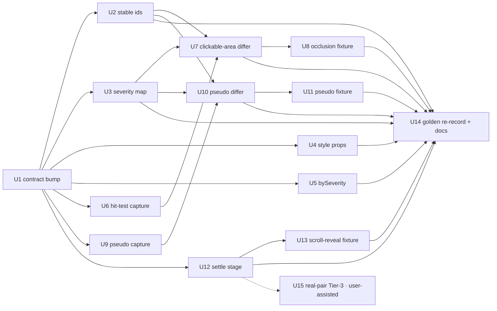

# feat: Port-parity feature set (issue #4)

## Summary

Implement all four features from GitHub issue ozten/MatchyMatchy#4 in one branch, five phases: gating ergonomics (severity mapping, stable ids, extended props, per-severity summary) and clickable-area hit-test diff first — they unblock issue-level gating — then pseudo-element capture, then the settle pass (shipped on by default), closing with a single audited golden re-record. Every capture-model addition rides optional bundle fields so frozen Tier-3 pairs replay unchanged, and every new detector lands with a deliberately-broken testbed variant proving it before goldens are recorded.

---

## Problem Frame

Matchy is being promoted from a secondary score-floor to the primary deep-parity engine in a Webflow→Next.js port pipeline whose readiness gate will consume typed issues directly. A human review round surfaced 15 visual defects; three defect classes are invisible to the current capture model (occluded click targets, CSS-generated `::before`/`::after` content, pre-animation states on scroll-triggered pages), and one ergonomics gap (2,500-issue `style_changed` floods, unstable issue ids) blocks gating on issues at all. The consumer is an LLM-driven pipeline, so signal-to-noise of the emitted contract is the product.

---

## Requirements

Traced to issue #4's checklists; R-numbers group by the issue's four items.

- **R1 — Clickable-area parity.** Capture-time `elementFromPoint` sampling over a deterministic grid for each interactive SemanticNode (after scroll-into-view); per-node hit data (fraction + miss-winner selectors) in the bundle; new `clickable_area_regressed` issue (severity error, respects `--scope`); `explain` prints per-side fractions and miss winners; no issue when both sides are occluded the same way.
- **R2 — Pseudo-element capture.** Capture `::before`/`::after` with `content ≠ none` as pseudo entries owned by their element (curated computed styles + best-effort bbox); alignment through owner + which-pseudo, never by content; `pseudo_element_missing` (warning; error under `strict-visual`) and `style_changed` on aligned pseudo pairs; `explain --selector "…::after"` locates them; bundle schema versioned with graceful degradation on old bundles.
- **R3 — Deterministic settle pass.** Scroll-through on a fixed schedule + quiescence wait bounded by hard timeout, on by default with `--no-settle`; composes with `--no-freeze-time` (and with freeze-time itself — see decisions); lazy images awaited to load-or-error; settle status recorded in the bundle and surfaced as a `volatile_capture`-style warning on timeout.
- **R4 — Gating ergonomics.** (a) Per-type and per-property severity mapping, built-in opinionated defaults + config file override; (b) computed-style coverage extended with `text-decoration`(-line), `z-index`, `max-width` (the other five properties named in the issue are already captured — verify with tests); (c) issue ids stable across re-captures for unchanged defects (fix derivation, document the guarantee); (d) a post-baseline, in-scope per-type count summary — plus per-severity counts so a gate can assert "0 remaining error+ in main" without re-deriving.
- **R5 — No regression to existing utility; high signal-to-noise for LLM consumers.** Existing goldens/Tier-3 pairs replay correctly (drift individually triaged, never blanket-blessed); every new issue type carries anchors, evidence, and structured remediation with grep targets; volume is capped and rendered evidence truncated; noisy sub-classes ship demoted by default.

---

## Scope Boundaries

- No `pseudo_element_added` issue type in this branch (see Deferred); the spec amendment records the asymmetry rationale.
- `::marker`, `::placeholder`, `::selection`, and other non-`before`/`after` pseudos are out of scope — stated in the spec amendment so the next defect round doesn't reopen the design.
- Interactive nodes inside iframes are not hit-tested (extraction is main-frame only); disabled controls hit-test like enabled ones (documented, not special-cased).
- No consumer-side gate logic (the readiness pipeline lives in the consumer's repo); matchy only guarantees the contract fields the gate reads.
- No capture retries to stabilize settle (retry-until-green is institutionally forbidden); the only sanctioned retry remains the recorded retry-without-freeze.
- No TOML profile system; severity mapping is one JSON file + frozen built-ins.
- Hard-Critical types (`load_error`, `status_code_mismatch`, `missing_form`) cannot be demoted by user severity maps (gate-integrity deny-list).

### Deferred to Follow-Up Work

- `pseudo_element_added` (symmetric type; also a potential occluder signal feeding R1): follow-up branch once the missing-direction ships.
- Live id-survival validation on p01 via `pair-refresh` (needs network + golden-audit of the re-frozen bundles): user-assisted follow-up; in-repo jitter tests stand in for it (U2).
- Red Tier-3 pair on a real Swiper/Webflow staging page locking the settle+freeze composition (needs real URLs from Austin): sanctioned TDD entry, not a golden change — do as soon as URLs are available (U15).
- CLI exposure of settle tuning knobs (step size, dwell, quiescence window): config-file only for now.

---

## Context & Research

### Relevant Code and Patterns

- `packages/capture/src/stabilizer.ts` — 13-step pipeline; step 8 `lazyLoadPass` already scroll-steps with `clock.runFor` dwell; retry-without-freeze (`shouldRetryWithoutFreeze`) and pre/post integrity inventory are the machinery R3 extends.
- `packages/capture/src/extract/page-model.ts` — in-browser extraction (self-contained; anything used inside `page.evaluate` is duplicated with sync-comments in `extract/computed-style.ts`); `classifyElement()` defines interactive kinds; 29-property computed-style list (comment says 28 — fix while touching).
- `packages/capture/src/schema.ts` — zod bundle schema, `schemaVersion: z.literal("1.0")`; closed prefix enum was the self-check cross-layer drift lesson: any new CaptureConfig vocabulary needs its own guard test in `tests/schema.test.ts`.
- `packages/analyze/src/issue.rs` — `compute_issue_id` (SHA-256 over type⟂viewport⟂8 anchors⟂styleProperty) and `resolve_id_collisions` (bbox-sorted suffixes — the instability source).
- `packages/analyze/src/scoring.rs:33` — `severity_for` hardcoded table R4a generalizes; `packages/analyze/src/config.rs` — frozen, evidence-annotated constants (the home for new thresholds and the severity default table).
- `packages/analyze/src/style_diff.rs` — leaf + ancestor channels, canonicalization ladder (numeric epsilon C2, url tail C3, semantic equivalence C4), `MIN_PAIRING_SCORE_FOR_STYLE` info-demotion gate: the pseudo channel and new properties route through this, never around it.
- `packages/analyze/src/orchestrate.rs:379-391` — `load_bundle` (version-agnostic serde parse) + `env_mismatch` warning: the pattern `capability_mismatch` mirrors.
- `packages/analyze/src/report/json.rs` — assembly order (baseline → scope → regions → clusters → summary); `agentSummary.byType` is already computed over kept issues (post-baseline, post-scope).
- Region-saturation-rollup commit sequence (`74bf617` → `75b63b4`) — the model for contract-first slices, renderer updates, DSL extension, and the single audited golden re-record.
- `testbed/check-fixture.py` expected-issues DSL — supports `minSeverity`/`maxSeverity`, evidence and anchor matchers; reused verbatim by `check-pair.py` (never fork it).

### Institutional Learnings

- `docs/bugs/p0-01-time-freeze-corrupts-baseline-capture.md` + `docs/bugs/ROOT-CAUSE-AND-PLAN.md` (WP-H) — the frozen-clock Swiper crash from issue #4 is this documented bug; every new settle step must join the determinism record, warnings promotion, and retry-without-freeze trigger set. "Analyze trusts capture unconditionally; log-and-continue is a silent no-op" — never log-and-continue a settle failure.
- `docs/bugs/p0-02-issue-ids-unstable-across-runs.md` + memory note — id instability has failed twice (tracking params in hrefs; then `ordinalInLandmark`/`nearestHeading` shifts — 2/129 survival on p01). Fix the identity boundary per issue type, not one hash field; normalize at identity derivation only (output anchors keep raw bytes for grep-ability).
- `docs/golden-changelog.md` (v1.1, v1.2 entries) — settled bump procedure: schema enum in lockstep with required fields, batch contract changes, re-record once, verify two ways, auditor APPROVE pasted into the changelog. Info-severity issues are excluded from category scores (v1.1 class 6) — severity demotions legitimately shift `scores.*`.
- `docs/calibration-note.md` + `docs/bugs/p1-05`, `p1-04` — byte-inequality ≠ regression: route every new comparison through canonicalization/epsilon/pairing-confidence layers; suppress at emission, narrowly (F1's input-stream filter silently killed 15 legit issues); constants frozen with per-constant evidence.
- `docs/issue-v08-srcset-404-flake.md` — a detector added after a golden was frozen fires on conditions the golden never baselined: after each new detector, re-run the full golden suite and triage every mismatch individually. Retries are rejected; srcset re-selection during scroll is a live determinism hazard the settle fixtures must vendor for.
- Self-check plan (`docs/plans/2026-07-09-001-…`) — cross-layer vocabulary drift (Rust-emitted values vs capture zod enums) is not covered by contract CI; new CaptureConfig fields need explicit vocabulary-guard tests.

### External References

- None needed — all patterns local; hit-testing (`document.elementFromPoint`), pseudo-element style reads (`getComputedStyle(el, "::before")`), and MutationObserver quiescence are standard web-platform APIs.

---

## Key Technical Decisions

- **Settle ships on by default (user-confirmed), landed inert-then-flipped.** Implement the full settle stage with the internal default off, force it on across the testbed to verify drift, then flip the default in a dedicated commit whose golden drift (expected ≈ zero on static fixtures) is triaged individually. Attribution stays clean: schema/id/detector drift and settle drift are separate re-record events if both occur.
- **Settle composes with freeze-time via the controlled clock, not around it.** Dwell and quiescence waits advance `page.clock` on a fixed schedule, so rAF/timer-driven animation (IX2, Swiper) progresses deterministically under a frozen wall-clock. Pathological pages fall into the existing recorded retry-without-freeze. Issue #4's alternative ("document that `--settle` requires `--no-freeze-time`, have `doctor` warn") is consciously dropped: the design removes the conflict; runtime warnings cover the residue. Per-side clock-advance asymmetry (different page heights ⇒ different total advance) is accepted and documented — animations-disabled mitigates it.
- **Bundle schema 1.0→1.1 with optional fields only; DiffResult 1.2→1.3 batched once.** All new bundle fields (`hitTest`, `pseudoElements`, settle/quiescence determinism statuses) are optional in zod and `#[serde(default)]` in Rust, so frozen Tier-3 bundles replay byte-identically; `load_bundle` stays version-agnostic. DiffResult adds the two issue types to the enum and a required `agentSummary.bySeverity`, forcing the standard audited re-record.
- **`capability_mismatch` run warning, mirroring `env_mismatch`.** Analyze emits one warning per channel (hit-test, pseudo, settle-ran) whenever that channel cannot run — absent on either or both sides — with context naming which side(s) lack it, instead of silently never firing the new detectors. Every existing frozen pair replays matched-vintage with the channels absent on *both* sides; every old-baseline re-run against a fresh capture is the one-sided case. Both must warn. Warning codes are free-string values: no extra schema surface.
- **Hit-test stores per-point outcomes; the threshold applies to a parity-adjusted fraction.** The bundle records each grid point as one of: hit, miss-with-winner-selector, `clipped` (the winner is an *ancestor* of the target — smaller/rounder rendering, not occlusion), or `offViewport` (`elementFromPoint` returns null for coordinates outside the viewport after centering) — grid derived from bbox, never stored coordinates. Analyze excludes `clipped` and `offViewport` points from the fraction on both sides (recorded in evidence, never counted as occlusion) and drops points that miss on *both* sides from the denominator before applying `old ≥ 0.9 && old − new > 0.1`. This makes rounded/pill CTAs detectable instead of permanently exempt, keeps a smaller-or-rounder-but-fully-clickable CTA from firing error-severity noise (that class belongs to `style_changed` on `border-radius`/size), and it *is* the issue's parity rule, generalized per-point. `pointer-events` joins the captured style list so the ancestor-exclusion cannot mask a `pointer-events: none` regression — the style channel catches it. A minimum surviving denominator guards degenerate cases; nodes too small to grid are recorded `skipped(reason)`, distinct from fraction 0. A point whose winner is the node's associated `label`/labeled control counts as a hit.
- **Hit-test probes run after screenshots, before axe** (mirrors the spec's probes-after-capture rule so scrolling can't pollute captured state), using fresh viewport-relative rects post-`scrollIntoView({block:"center"})` — centering avoids sticky-header shadowing; a sticky-header-regression flood collapses via the existing type+landmark clustering.
- **Pseudo data lives beside the node stream, keyed by owner + which-pseudo — the matcher is untouched.** Three owner tiers for alignment: (a) semantic-node owners via the existing `old_to_new_id` map; (b) ancestor descriptors via the ancestor style channel's descendant-set pairing; (c) decorative leaves (the motivating `[data-hr-corner-top]` case — invisible to tiers a/b) via a stable owner key preferring `id`/`data-*` attributes scoped to the nearest landmark. Entries are budget-capped with deterministic drop order and recorded truncation (mirrors `styleCandidates`).
- **Id stability: `ordinalInLandmark` AND `nearestHeading` leave the base hash; both survive only as last-resort disambiguators.** `nearestHeading` is a documented co-cause of the p01 2/129 failure (capture computes it from "first visible heading", which shifts with load/visibility state on live pages) — keeping it would repeat the p0-02 pattern of fixing one volatile input while the other survives. It stays identity-grade only for issue types that carry none of text/href/alt/ariaLabel. Identity-grade fields are enumerated per issue type (the §7.1 amendment). Content-identical repeats collide deliberately and get suffixes assigned by document order *within the colliding set* (not bbox sort) — inserting an unrelated sibling no longer shifts ids; only adding/removing an identical twin does (residual limitation documented; the nearestHeading demotion slightly enlarges colliding sets, which the suffix scheme exists to handle). Which-pseudo occupies the `styleProperty` hash slot (`::before` / `::before.background-image`), so the two new types don't recreate the collision disease. This amends spec §7.1 — the issue is a spec-change request from the primary consumer.
- **Severity mapping: frozen built-in defaults + one JSON map file; precedence built-in < profile < user map; deny-list on hard-Criticals.** Built-in per-property demotions (e.g. `letter-spacing`, `line-height` → info) live in `config.rs` as evidence-annotated constants (user-confirmed: opinionated defaults ship). The map applies across all three style channels (leaf, ancestor, pseudo). Attempted demotion of `load_error`/`status_code_mismatch`/`missing_form` is ignored with a run warning. The resolved overrides are echoed into DiffResult so two runs with different maps are never silently incomparable.
- **`agentSummary.byType` is already post-baseline + post-scope** (issue #4's premise was stale) — R4d becomes: document the guarantee, add tests pinning it, and add `agentSummary.bySeverity` over the same kept set for direct gate assertions.
- **Capture `text-decoration-line`, not the `text-decoration` shorthand** — the computed shorthand embeds color (`none solid rgb(0,0,0)`) and would be a noise source.
- **Hit-test/pseudo confidence couples to settle outcome.** When settle timed out or was skipped, hit-test entries are still captured but analyze demotes `clickable_area_regressed` confidence (existing determinism-driven confidence machinery); the `--self-check` probe's knownDrift seeding excludes the new channels initially (safer; revisit after calibration).

---

## Open Questions

### Resolved During Planning

- Settle default: **on by default** with `--no-settle` (user decision; flip staged as its own commit).
- Built-in severity demotion defaults: **ship them** (user decision; golden re-record covered by the batch).
- Id fix approach: **fix derivation directly** (user decision; one-time break to committed ledgers/goldens, changelog + auditor).
- Post-baseline summary: already true for `byType` — extend with `bySeverity` rather than re-plumb.
- Pseudo fixture feasibility: the golden page paints pseudo content (`[section-style="overlap"]::after`, nav icons) — a rule-removal variant works.
- Mixed-vintage safety: `capability_mismatch` warning (analyze-side Rust tests; no new testbed variant needed).

### Deferred to Implementation

- Exact quiescence window/timeout and settle step-growth cap values: calibrate on the scroll-reveal fixture; freeze in `config`/stabilizer constants with evidence comments.
- Pseudo entry budget and hit-test minimum-denominator constants: pick during implementation, freeze with evidence.
- Exact shape of the collision-suffix scheme (suffix format, old-vs-new-side ordering for added-only issues): settle in U2 under its unit tests.
- Whether `explain --anchor` should also surface a matched owner's pseudo entries by default or behind a flag: decide when wiring U10.
- Markdown/HTML rendering polish for the new evidence beyond truncation rules: iterate after U7/U10 land.

---

## High-Level Technical Design

> *This illustrates the intended approach and is directional guidance for review, not implementation specification. The implementing agent should treat it as context, not code to reproduce.*

Capture-side stage order (new stages marked ▲):

```
stabilize (steps 1–7)
  → settle ▲ (evolved step 8: viewport-height scroll steps + clock-driven dwell
              → lazy-image await (load|error, incl. newly inserted)
              → return to top → quiescence wait (MutationObserver, masked-subtree
              mutations ignored, hard timeout) → statuses into determinism block)
  → hide/mask (step 9)
  → extractPageModel  (+ pseudo scan ▲: styleCandidates ∪ painted-pseudo owners,
                        curated props, owner keys, budget)
  → probeLinks → screenshots
  → hit-test probe ▲  (per interactive node: scrollIntoView(center), fresh rect,
                        5×5 grid 2px inset, per-point hit|miss(winner)|skipped)
  → clock.resume → axe
```

Analyze-side additions all hang off existing seams: `capability_mismatch` beside `env_mismatch`; the hit-test differ consumes matched pairs; the pseudo differ runs as a third style channel through the existing canonicalization ladder; severity resolution becomes `built-in table → profile → user map (deny-list enforced)` feeding the unchanged `--fail-on`/scores machinery.

Unit dependency graph:



---

## Implementation Units

### U1. Batched contract bump (bundle 1.1, DiffResult 1.3, empty population)

**Goal:** All schema surface for the four features lands once, in lockstep across JSON Schema / zod / serde, populated empty so every later unit is additive code, not contract churn.

**Requirements:** R1, R2, R3, R4d (contract halves)

**Dependencies:** None

**Files:**
- Modify: `contract/capture-bundle.schema.json`, `contract/diff-result.schema.json`
- Modify: `packages/capture/src/schema.ts`, `packages/analyze/src/contract.rs`, `packages/analyze/src/report/json.rs`, `packages/analyze/src/report/html.rs`, `packages/analyze/src/report/markdown.rs`
- Test: `packages/capture/tests/schema.test.ts`, schema-validation unit tests in `packages/analyze/src/semantic_diff.rs` / `hygiene.rs`

**Approach:**
- Bundle 1.0→1.1: optional per-node hit-test outcomes, optional `pseudoElements` map, new settle/quiescence statuses in `determinism`, new CaptureConfig fields (settle enable + knobs). All optional/defaulted so frozen 1.0 bundles parse and replay unchanged. zod literal, JSON-schema const, and vitest expectations move together (v1.1 lockstep lesson).
- DiffResult 1.2→1.3: `clickable_area_regressed` + `pseudo_element_missing` in the type enum; required `agentSummary.bySeverity`; optional resolved-severity-map echo. Renderers serialize the new fields from day one.
- CaptureConfig additions get vocabulary-guard tests (self-check lesson: contract CI doesn't cover the config seam).

**Patterns to follow:** region-rollup U1 commit `74bf617` (contract shape first, empty population).

**Test scenarios:**
- Happy path: assembled DiffResult with empty new fields validates against 1.3 schema (Rust jsonschema test); fresh bundle with no hit/pseudo data validates against 1.1 (zod + check-fixture path).
- Edge case: frozen p01 1.0 bundles still parse via serde and replay to a schema-valid DiffResult (`make pair CASE=p01…`).
- Error path: bundle claiming 1.1 with a malformed `pseudoElements` entry fails zod at write time with `BUNDLE_INVALID`.
- Integration: `testbed/check-fixture.py` validates a fresh 1.1 bundle + 1.3 diff-result pair end-to-end on v01.

**Verification:** `cargo test` + `vitest` schema suites green; `make pair CASE=p01-hiya-number-registration` green (goldens elsewhere expectedly red until U14).

---

### U2. Stable issue ids (identity-boundary fix + spec §7.1 amendment)

**Goal:** Ids survive re-captures for unchanged defects: `ordinalInLandmark` leaves the hash, identity-grade fields are enumerated per issue type (including the two new types), and collision suffixes stop depending on bbox pixels.

**Requirements:** R4c, R5

**Dependencies:** U1 (new types exist in the enum for identity-grade enumeration)

**Files:**
- Modify: `packages/analyze/src/issue.rs`, `docs/prds/page-pair-diff-spec.md` (§7.1 amendment), `docs/golden-changelog.md` (entry drafted here, auditor verdict at U14)
- Test: unit tests in `issue.rs`

**Approach:**
- Hash inputs per issue type: type + viewport + the identity-grade anchor subset (text/role/href/alt/ariaLabel/landmark — href already query-normalized; `nearestHeading` identity-grade only for types carrying none of text/href/alt/ariaLabel, otherwise a last-resort disambiguator alongside ordinal) + styleProperty slot, where which-pseudo prefixes the slot for pseudo issues and the slot is empty for `clickable_area_regressed`.
- `resolve_id_collisions`: suffix by document order within the colliding set (old-side seqIndex primary; new-side for added-only issues), never bbox. Document the residual identical-twin limitation in the amendment.
- `baseline_stale_ids` warning behavior preserved so old ledgers degrade loudly, not silently.

**Execution note:** Test-first — write the jitter/survival tests before touching the hash.

**Test scenarios:**
- Happy path: identical bundles → identical ids (existing byte-determinism invariant holds).
- Edge case (the p01 disease): clone a bundle, remove 80% of one landmark's nodes so every survivor's ordinal shifts → surviving issues keep their ids.
- Edge case (capture-time heading shift): rewrite survivors' `nearestHeading` fields in the cloned bundle (simulating a re-capture visibility shift) → issues carrying text/href/alt/ariaLabel keep their ids.
- Edge case: three identical "Read more" links each with the same style diff → three distinct ids, stable when re-derived from a bbox-jittered copy; removing the middle twin changes only that twin's id space, `baseline_stale_ids` fires for its ledger entry.
- Edge case: `::before` and `::after` issues on the same owner → distinct ids.
- Error path: jittered bbox / match-score / artifact-path perturbations never change any id (existing exclusion tests extended).

**Verification:** id unit suite green; a scripted p01 self-comparison (analyze old-bundle vs a synthetically perturbed copy) shows ≥ ~127/129 id survival; spec §7.1 amended in the same commit.

---

### U3. Severity mapping (built-in defaults + `--severity-map` file + deny-list)

**Goal:** Per-type and per-property severity resolution with shipped opinionated defaults, one JSON override file, and gate-integrity guarantees.

**Requirements:** R4a, R5

**Dependencies:** U1

**Files:**
- Modify: `packages/analyze/src/scoring.rs`, `packages/analyze/src/config.rs`, `packages/analyze/src/bin/matchy.rs` (flag), `packages/analyze/src/report/json.rs` (echo), `packages/analyze/src/style_diff.rs` (per-property lookup on all channels)
- Test: unit tests in `scoring.rs` / `style_diff.rs`

**Approach:**
- Resolution order: built-in per-property/per-type table (frozen, evidence-annotated in `config.rs`) → profile category defaults → user map. Hard-Critical deny-list enforced last with a run warning on attempted demotion.
- Built-in demotions target cascade tails: `letter-spacing`, `line-height` (hundredths) → info; `color`, `font-size`, `text-align`, `background-color` stay at profile severity. Exact table finalized against the v03/v04/v05 fixture outputs.
- Resolved non-default overrides echoed into DiffResult; document that info-severity issues are excluded from category scores (so demotions shift `scores.style` — v1.1 class 6 precedent).

**Test scenarios:**
- Happy path: default run demotes a letter-spacing-hundredths diff to info while a color diff stays warning; `--fail-on warning` exit code reflects only the latter.
- Happy path: user map promoting `pseudo_element_missing` to error under `content-structure` is honored and echoed in the output.
- Error path: map file demoting `status_code_mismatch` to info → demotion ignored, run warning emitted, exit code unchanged.
- Edge case: map file with unknown type/property keys → schema error (exit 2), not silent ignore.
- Integration: same bundle pair, two different maps → different `scores.style`, both runs carry their map echo (never silently incomparable).

**Verification:** v05 (cta-style) and v03 (font-size) expected-issues still pass; new severity assertions added to their `expected-issues.json` files where intent changed (golden-discipline entry drafted).

---

### U4. Extended computed-style coverage (4 properties + count fix)

**Goal:** `text-decoration-line`, `z-index`, `max-width`, `pointer-events` captured and diffed (the last so U7's ancestor-exclusion cannot mask a `pointer-events: none` regression); the five already-captured properties from the issue verified by test.

**Requirements:** R4b

**Dependencies:** U1

**Files:**
- Modify: `packages/capture/src/extract/page-model.ts` (inline list), `packages/capture/src/extract/computed-style.ts` (mirror), `packages/analyze/src/config.rs` (`STYLE_DIFF_PROPERTIES`), `packages/analyze/src/style_diff.rs` (canonicalization rules)
- Test: `packages/capture/tests/computed-style.test.ts`, `style_diff.rs` unit tests

**Approach:** Both capture copies edited with sync-comments intact; fix the stale "28-prop" count comment. Canonicalization for the newcomers: `z-index: auto`, `max-width: none`, `text-decoration-line: none`, `pointer-events: auto` equivalences through the existing C4 layer; numeric epsilon applies to `max-width` lengths.

**Test scenarios:**
- Happy path: element with `text-decoration-line: underline` on old, `none` on new → `style_changed` with property-level from/to.
- Happy path (issue's motivating list): assert `text-align`, `border-radius`, `background-image`, `position` (+ `z-index`, `max-width`) are present in a captured bundle's style entries for a candidate node.
- Edge case: `max-width: none` vs a computed `none` from a different declaration path → no issue; `z-index: auto` vs `auto` → no issue.
- Edge case: `text-decoration` shorthand differing only in embedded color while `-line` matches → no issue (that's why `-line` is captured).
- Happy path: `pointer-events: auto` on old, `none` on new for an interactive node → `style_changed` with property-level from/to.

**Verification:** capture mirror test green; a hand-built bundle pair exercising each new property yields exactly the intended issues.

---

### U5. `agentSummary.bySeverity` + documented byType guarantee

**Goal:** Gates can assert "0 remaining error+ in scope" straight from the summary; the existing post-baseline/post-scope semantics of `byType` become a documented, test-pinned guarantee.

**Requirements:** R4d

**Dependencies:** U1

**Files:**
- Modify: `packages/analyze/src/report/json.rs`, `README.md`, `docs/prds/page-pair-diff-spec.md` (§7 note)
- Test: `report/json.rs` unit tests

**Approach:** `bySeverity` computed over the same kept set (post-baseline, post-scope) as `byType`, BTreeMap for determinism.

**Test scenarios:**
- Happy path: run with 3 errors, 1 baselined, 1 out-of-scope → `bySeverity.error == 1`, matching a manual filter of `issues[]`.
- Edge case: all issues suppressed → `bySeverity` empty object (not absent), `byType` empty — pinned so gates can rely on presence.
- Integration: `--scope main --baseline ledger.json` on a fixture: summary counts equal the visible issue list's counts exactly.

**Verification:** unit tests green; README gate-recipe snippet documents the guarantee.

---

### U6. Hit-test capture probe

**Goal:** Deterministic per-node clickability evidence in the bundle for every interactive node.

**Requirements:** R1

**Dependencies:** U1

**Files:**
- Modify: `packages/capture/src/capture.ts` (stage insertion), `packages/capture/src/extract/page-model.ts` (interactive eligibility incl. `[onclick]`, selector builder reuse), `packages/capture/src/schema.ts`
- Test: `packages/capture/tests/` (new hit-test vitest against a local fixture page)

**Approach:**
- Runs after screenshots, before `clock.resume`/axe. Per eligible node: `scrollIntoView({block:"center"})`, fresh viewport-relative rect, 5×5 grid inset 2px, `elementFromPoint` per point; per-point outcome is one of hit (node/descendant/labeled-control), miss (winner's selector via the existing selector builder), `clipped` (winner is an ancestor of the target), or `offViewport` (point falls outside the viewport after centering / `elementFromPoint` returns null) — outcomes stored, coordinates never.
- Nodes with either axis < 5px, off-document, or detached → `skipped(reason)`. Determinism block gains a hit-test step status; failures under frozen clock join the retry-without-freeze trigger set.

**Test scenarios:**
- Happy path: fully clickable button → 25/25 hits.
- Happy path: button overlapped by a positioned sibling image → misses record the image's selector.
- Edge case: pill-radius CTA → corner points record `clipped` (winner is the parent/ancestor); recorded faithfully (exclusion is analyze's job).
- Edge case: full-section link-block taller than the viewport → points that can't be brought on-screen record `offViewport`, never miss.
- Edge case: 1px-tall skip-link → `skipped(tooSmall)`, not fraction 0.
- Edge case: label-wrapped input — points landing on the label count as hits for the field node.
- Integration: two captures of the same static page → byte-identical hit-test data (grid determinism).

**Verification:** vitest suite green; v01 control capture carries hit-test data with all interactive nodes at full hits.

---

### U7. `clickable_area_regressed` differ + explain + rendering

**Goal:** The analyze half of R1: parity-adjusted detection, evidence, remediation, explain output, capability warning.

**Requirements:** R1, R5

**Dependencies:** U1, U2, U3, U6

**Files:**
- Create: `packages/analyze/src/hit_test_diff.rs`
- Modify: `packages/analyze/src/lib.rs`, `config.rs` (frozen thresholds 0.9 / 0.1 / min-denominator), `explain.rs`, `report/{json,html,markdown}.rs`, `orchestrate.rs` or `report/json.rs` (`capability_mismatch`)
- Test: `hit_test_diff.rs` unit tests with hand-built bundles

**Approach:**
- For matched pairs where both sides carry hit data: exclude `clipped` and `offViewport` points on both sides (recorded in evidence, never counted as occlusion), drop points missing on both sides from the denominator; if survivors < min-denominator, skip (low-confidence, no issue). Fire on adjusted `old ≥ 0.9 && old − new > 0.1`; severity error via the U3 table; confidence demoted when either side's settle timed out or was skipped. A smaller/rounder-but-fully-clickable CTA must not fire — its geometry drift surfaces through the style channel (`border-radius`, size, `pointer-events`), not as occlusion.
- Evidence: per-side adjusted fractions + top-3 miss winners by count (full list stays in the bundle); remediation carries the miss-winner selectors as grep/fix targets plus the node's anchors. Clusters form via existing type+landmark rules (a sticky-header flood becomes one work item).
- `capability_mismatch` warning per channel whenever the channel is unavailable on either or both sides (context names which side(s) lack it); detector silent in those cases, loudly. The one-sided case is a subcase; both-sides-absent (frozen-pair replay) also warns.
- `explain`: when a located node has hit data, print per-side fraction and miss winners.

**Test scenarios:**
- Happy path (motivating defect): old 25/25, new 3/25 with sibling-img winner → one error issue, winners in evidence and remediation.
- Happy path (parity rule): both sides 12/25 occluded identically → no issue.
- Edge case (pill CTA): corners `clipped` both sides → denominator 21, old 21/21, new 21/21 → no issue; new drops to 10/21 → fires.
- Edge case (smaller/rounder port): old corners hit, new corners `clipped` to the parent (smaller button, same radius), all interior points hit both sides → no `clickable_area_regressed` (the regression class is style, not occlusion).
- Edge case (asymmetric heights): a section-link taller than the viewport on old only → old's `offViewport` points excluded symmetrically; no phantom misses.
- Edge case: old adjusted fraction 0.85 (after dropping both-side misses) → below floor → never fires regardless of new.
- Edge case: one side `skipped(tooSmall)`, other measured → no issue, no junk delta.
- Error path: old bundle lacks the channel entirely → `capability_mismatch` warning (context: old side), zero clickable issues.
- Error path: both bundles lack the channel (frozen-pair replay) → `capability_mismatch` warning (context: both sides), zero clickable issues.
- Integration: `--scope main` excludes a footer-landmark regression from issues and summary.

**Verification:** unit suite green; `matchy explain` output shows fractions on a hand-built pair; v01 golden run emits zero clickable issues.

---

### U8. Occlusion fixture (v22-cta-occluded)

**Goal:** Tier-1 proof of R1 end-to-end: golden CTA clickable, variant occludes it with one decorative absolutely-positioned sibling image.

**Requirements:** R1, R5

**Dependencies:** U6, U7 (fixture authored by fixture-builder; intent authored here first)

**Files:**
- Create: `testbed/variants/v22-cta-occluded/{site/,serve.py,manifest.json,expected-issues.json}`
- Modify: `testbed/run-all.py` (port 47022)

**Approach:** One deliberate change: the bleeding image (knock-on: a `missing_image`-free added decorative img must be declared in the manifest and, if it emits `visual_region_changed`/added-image noise, asserted deliberately). `expected-issues.json` (intent, authored before goldens): required `clickable_area_regressed` with `minSeverity: error` and evidence containing the image's selector; forbidden duplicate flooding.

**Test scenarios:** (fixture-level intent)
- Required: exactly one `clickable_area_regressed` anchored to the CTA.
- Forbidden: `clickable_area_regressed` on any other node; no `missing_link` for the still-present CTA.
- Control: v01 must remain zero-issue with hit-test enabled.

**Verification:** `make fixture VARIANT=v22` green against intent; full 21-variant suite re-run and individually triaged (new-detector lesson).

---

### U9. Pseudo-element capture

**Goal:** Painted `::before`/`::after` captured with curated styles, best-effort bbox, and three-tier owner keys.

**Requirements:** R2

**Dependencies:** U1

**Files:**
- Modify: `packages/capture/src/extract/page-model.ts`, `packages/capture/src/schema.ts`
- Test: `packages/capture/tests/` (pseudo extraction vitest fixture page)

**Approach:**
- Candidate set: styleCandidates (semantic nodes + ancestor chains) ∪ a document scan for elements with rendered pseudo `content ≠ none/normal`; owners failing `checkVisibility({checkOpacity, checkVisibilityCSS})` are excluded, mirroring node extraction — this also keeps `hideSelectors`-hidden subtrees (cookie banners, volatile chrome) out of the pseudo channel. Per-page budget with deterministic drop order (viewport-distance then document order) and recorded truncation.
- Tier-c owner-key content (`id`/`data-*` attribute values) passes through the same control-character-strip + length-cap pipeline used for other attribute-derived anchor fields (href, aria-label) before storage — these are attacker-influenceable page strings that flow into locators, renderers, and the LLM-consumed contract.
- Curated props: `content`, `position`, `width`, `height`, `background-color`, `background-image`, `border*`, `top/right/bottom/left`, `z-index` (+ `display`, `opacity` for visibility judgment). bbox best-effort (owner rect + resolved offsets for positioned pseudos; omitted when unresolvable).
- Owner key tiers recorded per entry: semantic node id / ancestor descriptor / landmark-scoped stable selector preferring `id` and `data-*` attributes.

**Test scenarios:**
- Happy path: `[data-hr-corner-top]::before` painted tick on a decorative leaf div → captured with tier-c key carrying the data-attribute selector.
- Happy path: nav icon `::before` on a semantic node → tier-a entry keyed by node id.
- Edge case: `content: none` and `content: normal` → not captured; empty-string content with visible box (`[section-style="overlap"]::after`) → captured.
- Edge case: icon-font page with 1,000 pseudos → budget respected, truncation recorded, drop order deterministic across two captures.
- Edge case: pseudo with unresolvable bbox → entry present, bbox absent.
- Edge case: a subtree hidden via `hideSelectors` with a painted `::before` → no pseudo entry (checkVisibility exclusion).
- Error path: an `id`/`data-*` value that is oversized or laden with control characters → tier-c owner key stored capped and stripped through the shared pipeline; renders safely.

**Verification:** vitest green; a golden-page capture contains the known `[section-style="overlap"]::after` entry.

---

### U10. Pseudo differ + explain (`pseudo_element_missing`, pseudo `style_changed`)

**Goal:** Analyze half of R2 with owner-based alignment and the existing canonicalization ladder.

**Requirements:** R2, R5

**Dependencies:** U1, U2, U3, U9

**Files:**
- Create: `packages/analyze/src/pseudo_diff.rs`
- Modify: `packages/analyze/src/lib.rs`, `style_diff.rs` (shared canonicalization access), `explain.rs` (`--selector "…::before|::after"` parsing, owner-anchor fallback), `report/*` (crop falls back to owner bbox)
- Test: `pseudo_diff.rs` unit tests with hand-built bundles

**Approach:**
- Align owners tier-by-tier; within an aligned owner, `::before` pairs with `::before` only. Old painted + owner aligned + new absent → `pseudo_element_missing` (warning; error under strict-visual via U3 table). Semantic/ancestor (tier-a/b) owner itself unmatched → owner's own missing_* issue, no pseudo issue (no double-count). Both absent → nothing. New-only → nothing in this branch (deferred type).
- Unaligned tier-c disposition: an old-side tier-c owner with a painted pseudo and no key-matched new owner (the port dropped the `id`/`data-*` attribute along with the rule — the motivating defect's most common real form) emits `pseudo_element_missing` at demoted confidence, anchored to the old-side landmark-scoped selector, with the alignment-tier failure recorded in evidence. Tier-c owners have no tier-a/b fallback, so silence here would blind the feature to its own acceptance case.
- Truncation guard: when the counterpart bundle records pseudo truncation, `pseudo_element_missing` for tier-b/c owners demotes to info and a `pseudo_budget_truncated` run warning is emitted — asymmetric budget drops (viewport-distance ordering differs per side by the tool's premise) must not fabricate missing-pseudo warnings.
- Aligned pairs diff through the canonicalization ladder (content-value canonicalization: quotes, `url()` tails, counters); per-property severity map applies; ids use the which-pseudo styleProperty slot (U2).
- `capability_mismatch` when one side lacks the channel; issue anchors/locator inherit the owner's anchors (locality bonus follows owner strength).

**Test scenarios:**
- Happy path (motivating defect): corner-tick `::before` on old, attribute present but no painting rule on new → one `pseudo_element_missing` warning anchored to the owner, styles in evidence.
- Happy path: aligned `::after` background-color changed → `style_changed` with `::after.background-color` in remediation.
- Edge case: owner missing entirely on new → owner missing_* only, zero pseudo issues.
- Edge case: `::before` present both sides, `::after` old-only, same owner → exactly one pseudo issue, distinct id from any `::before` issue.
- Edge case: pseudo painted on the new side only (aligned owner, old absent) → zero pseudo issues (pins the deferred `pseudo_element_added` asymmetry).
- Happy path (attribute-dropped port): old tier-c owner with painted `::before`, new side lacks both the attribute and the rule → `pseudo_element_missing` at demoted confidence with the alignment failure in evidence.
- Edge case (asymmetric truncation): counterpart bundle records pseudo truncation → tier-b/c `pseudo_element_missing` demoted to info + `pseudo_budget_truncated` warning.
- Edge case: strict-visual profile → the same missing pseudo emits at error.
- Error path: old bundle without pseudo channel → warning, no pseudo issues.

**Verification:** unit suite green; `matchy explain --selector '[section-style="overlap"]::after'` locates the entry on a golden-page bundle.

---

### U11. Pseudo fixture (v23-pseudo-rule-removed)

**Goal:** Tier-1 proof of R2: variant deletes the `[section-style="overlap"]::after` painting rule from the golden page's CSS.

**Requirements:** R2, R5

**Dependencies:** U10

**Files:**
- Create: `testbed/variants/v23-pseudo-rule-removed/{site/,serve.py,manifest.json,expected-issues.json}`
- Modify: `testbed/run-all.py` (port 47023)

**Approach:** One deliberate change (rule deletion; element and attributes untouched — exactly the inert-for-weeks failure mode). Intent: required `pseudo_element_missing` (`minSeverity: warning`); forbidden `missing_text`/`missing_image`/added noise for the untouched section.

**Test scenarios:** required/forbidden as above; v01 control still zero-issue with pseudo capture on.

**Verification:** `make fixture VARIANT=v23` green; full-suite re-triage after the detector lands.

---

### U12. Settle pass (stabilizer evolution + `--no-settle`)

**Goal:** R3: the existing lazy-load pass becomes a full deterministic settle stage with quiescence, recorded status, and warnings — on by default at the end of this unit's staged flip.

**Requirements:** R3, R5

**Dependencies:** U1

**Files:**
- Modify: `packages/capture/src/stabilizer.ts`, `packages/capture/src/capture.ts`, `packages/capture/src/schema.ts` (config vocab), `packages/analyze/src/orchestrate.rs` (config build), `packages/analyze/src/bin/matchy.rs` (`--no-settle`), `packages/analyze/src/report/json.rs` (warning promotion), `packages/analyze/src/bin/matchy.rs` self-check (exclude new channels from knownDrift seeding)
- Test: `packages/capture/tests/stabilizer.test.ts` additions; Rust warning tests

**Approach:**
- Evolve step 8: viewport-height steps with per-step `scrollHeight` re-read and a growth cap (~3× initial or max-steps, whichever first — exceeded → recorded + warning); fixed dwell via `clock.runFor` (wall-timeout without clock); lazy images awaited to load-or-error including ones inserted mid-scroll; return to top; quiescence = no un-ignored DOM mutations for the window (mutations under hide/mask subtrees ignored) bounded by hard timeout, clock-driven.
- Statuses: `settle` ran/failed/skipped, `quiescence` reached/timeout, scroll-ineffective detection (scrollY never moved — transform-scroll sites) recorded distinctly. All failures join the retry-without-freeze trigger set and promote to `warnings[]` (`settle_quiescence_timeout` etc. — free-string codes).
- Staged flip: land with internal default off; force-on across all 21 variants + p01-style analyze replays to verify drift ≈ zero; flip the default in a dedicated commit.
- `--no-settle` reverts step 8 to the legacy lazyLoadPass semantics (scroll-steps + clock dwell + image await; no quiescence, growth-cap, or new statuses) — it must never produce captures worse than any shipped version, and it's the flag users reach for exactly when debugging a problem page (an outright stage-skip would flood false `missing_image`). Full stage-skip is reachable only via the config file. Old determinism key kept for continuity.

**Execution note:** Add characterization coverage of current step-8 behavior (srcset-flake history) before evolving it.

**Test scenarios:**
- Happy path: static page → settle ran, quiescence reached on first check, capture time impact bounded.
- Happy path: scroll-triggered reveal page → below-fold content captured post-animation (opacity 1, translated home).
- Edge case: rAF marquee → quiescence timeout at hard bound, single timeout warning with persistent-animator reason, capture completes.
- Edge case: page growing under scroll (infinite feed) → cap hit, recorded, deterministic step count.
- Edge case: transform-scroll site → `settle: ineffective` recorded; no false "ran" claim.
- Error path: settle step throws under frozen clock → retry-without-freeze fires, `retriedWithoutTimeFreeze` recorded, warning emitted.
- Integration: `--no-settle` → legacy lazy-load behavior preserved (below-fold lazy images still load; no false `missing_image`), quiescence statuses read skipped, analyze emits `capability_mismatch` when compared against a settled bundle.
- Integration: `--no-freeze-time --settle-default` combination captures cleanly (dwell via wall timeouts).

**Verification:** vitest green; all 21 variants byte-stable across two force-on captures; default-flip commit shows individually-triaged (≈ zero) golden drift.

---

### U13. Scroll-reveal fixture (v24-scroll-reveal)

**Goal:** Tier-1 proof of R3: a variant with deterministic IX2-like scroll-triggered reveal animation must produce zero content issues once settle runs.

**Requirements:** R3, R5

**Dependencies:** U12

**Files:**
- Create: `testbed/variants/v24-scroll-reveal/{site/,serve.py,manifest.json,expected-issues.json}`
- Modify: `testbed/run-all.py` (port 47024)

**Approach:** One deliberate change: below-fold sections start `opacity:0; transform:translateY(…)` and reveal via a scroll-position-driven (not wall-clock) script — deterministic by construction, srcset candidates vendored (v08 lesson). Intent: `status` pass-equivalent; forbidden `missing_text`/`missing_image`/`visual_region_changed` floods; required: none (the absence is the assertion). Manifest documents that without settle this variant false-positives — the negative control is captured with `--no-settle` in the variant's check script commentary, not in CI.

**Test scenarios:** forbidden-noise assertions above; determinism spot-check (two captures byte-identical) added to `make verify`'s spot-check list for this variant.

**Verification:** `make fixture VARIANT=v24` green; capture with `--no-settle` demonstrably red (manual/proof step recorded in manifest notes).

---

### U14. Golden re-record + changelog + auditor + docs

**Goal:** One audited re-record covering the batched contract bump, id fix, severity defaults, new props, and detectors; documentation catches up.

**Requirements:** R5 (+ documentation halves of R1–R4)

**Dependencies:** U2, U3, U4, U5, U7, U8, U10, U11, U12, U13

**Files:**
- Modify: `testbed/goldens/*.diffresult.json` (all, incl. new v22–v24), `docs/golden-changelog.md`, `README.md`, `docs/prds/page-pair-diff-spec.md` (§4.4 prop list, §7.1 identity amendment, §7.3 taxonomy, pseudo scope notes, settle in §4.2), `testbed/pairs/p01…/expected-issues.json` if intent evolved
- Test: `make verify` end-to-end

**Approach:** Re-record once; verify two ways (field-level transform check + independent fresh-run comparison — the v1.1 procedure); every golden's diff individually triaged, never blanket-blessed. Because the U2 id fix rewrites every issue id at the same moment severity/score/field changes land, run a mechanical id-migration pre-pass first: a script recomputes each old golden's issue ids under the U2 derivation (ids are content-addressed from anchor fields already present in the golden JSON), so the triaged diff contains only semantic drift instead of total churn that a real regression could hide inside. Note the script in the changelog. Changelog entries for id fix, severity defaults, schema bumps, each with spec-section justification; golden-auditor APPROVE verdicts pasted in. Settle default-flip drift, if any, is its own entry (U12 staging).

**Test scenarios:** Test expectation: none — this unit is the verification event itself; its content is the audited re-record.

**Verification:** `make verify` exit 0 (build, unit, 24 fixtures, Tier-3 pairs incl. p01 replay with `capability_mismatch` warning but unchanged issue set, golden comparison, determinism spot-checks); changelog complete with auditor verdicts.

---

### U15. Real-pair Tier-3 fixture (user-assisted; red allowed)

**Goal:** Lock the settle+freeze composition and the clickable/pseudo detectors against a real Webflow staging page (the Swiper site), and seed the ledger workflow on real bundles.

**Requirements:** R1, R2, R3 (real-world lock)

**Dependencies:** U12 (capture side complete); real URLs from Austin

**Files:**
- Create: `testbed/pairs/p02-…/` via `make pair-add`
- Modify: `testbed/pair_privacy.py` (manifest + credential-scan coverage of the new field classes)

**Approach:** Adding a new red pair is not a golden change (no auditor needed); expectedState red is acceptable if any defect class remains unhandled — that's the sanctioned TDD entry. Before any real-page capture is frozen: extend `pair_privacy.py`'s human-review manifest (and the credential scan's field enumeration where these fields can carry token-shaped strings) to surface samples of the new bundle field classes — hit-test miss-winner selectors and `pseudoElements` owner keys/`content` values. The existing gate is field-enumerated, not a generic content scan; without this, sensitive strings in `data-*` attributes or pseudo `content` would be committed to the public repo unreviewed.

**Test scenarios:**
- Integration: capture with settle default-on against the Swiper page completes without the DOM-truncation failure documented in p0-01; `determinism` shows settle ran (or a recorded, warned degradation — never silent).

**Verification:** `make pair CASE=p02-…` green (or gate-safe XFAIL if red).

---

## System-Wide Impact

- **Interaction graph:** capture stage order changes (settle before hide/mask; hit-test after screenshots); analyze pipeline gains two differs and a third style channel; summary assembly gains one field; severity resolution centralizes a previously hardcoded table. `--fail-on`, exit codes, clustering, regions, and baseline machinery are consumed unchanged.
- **Error propagation:** every new capture step reports through the determinism block → `warnings[]` promotion → retry-without-freeze set. No new exit-code semantics; exit 2 stays reserved for tool failure.
- **State lifecycle risks:** the id derivation change invalidates all committed baseline ledgers and byte goldens exactly once — `baseline_stale_ids` makes stale ledgers loud; the changelog documents the migration ("re-run, re-accept").
- **API surface parity:** `explain` and both renderers must handle hit/pseudo evidence wherever `analyze` emits it; `show`'s generic issue rendering picks the new types up via the enum; `doctor` intentionally unchanged (requirement disposition in Key Decisions).
- **Integration coverage:** channel-absent replays (both sides 1.0) exercised by every existing Tier-3 pair, one-sided mixed-vintage (1.0 vs 1.1) by Rust tests; the v22/v23/v24 fixtures prove capture→analyze end-to-end per feature.
- **Unchanged invariants:** analyze remains a pure function of two bundles; byte-determinism invariants (BTreeMap, total-order tie-breaks, fixed-order reductions) apply to all new code; anchors never name components; page-derived strings (including miss-winner selectors, tier-c owner-key selectors, and pseudo `content` values) stay length-capped, escaped, untrusted.

---

## Risk Analysis & Mitigation

| Risk | Likelihood | Impact | Mitigation |
|------|-----------|--------|------------|
| Settle default flip perturbs existing captures/goldens | Med | Med | Staged inert→flip with dedicated commit; static fixtures expected zero-drift; individual triage |
| Id fix breaks consumers' committed ledgers | Certain (once) | Med | User-approved; `baseline_stale_ids` warning; changelog migration note |
| Hit-test flaky on pages that never quiesce | Med | High (error-severity flakes) | Confidence demotion on settle timeout/skip; parity-adjusted denominator; min-denominator skip |
| Pseudo capture floods bundles on icon-font sites | Med | Med | Budget + deterministic drop + truncation record; content canonicalization; per-property severity |
| New detectors fire on conditions old goldens never baselined | High | Med | Full-suite re-triage after each detector (v08 lesson); intent files before goldens |
| Channel-absent/mixed-vintage comparisons silently disable new detectors | Certain for frozen pairs | High for gate trust | `capability_mismatch` warning per channel, fired when absent on either or both sides |
| New bundle field classes freeze un-reviewed PII into the public repo via Tier-3 | Low | High | `pair_privacy.py` manifest + credential scan extended to the new fields before U15 (see U15) |
| Severity map lets a config green-light a 500 | Low | Critical | Hard-Critical deny-list + warning |
| Capture wall-time grows (settle dwell + per-node scrolling) | High | Low | Bounded schedules; skip rules; document expected overhead in README |
| p01 id-survival target unverifiable without live re-capture | Med | Low | Synthetic perturbation tests in-repo; live validation deferred (user-assisted) |

---

## Phased Delivery

1. **Phase A (U1–U5)** — contract + gating ergonomics: unblocks issue-level gating with zero new capture behavior.
2. **Phase B (U6–U8)** — clickable-area parity: first new capture channel + detector + fixture.
3. **Phase C (U9–U11)** — pseudo-element capture: second channel + detector + fixture.
4. **Phase D (U12–U13)** — settle pass, staged default flip: last because it perturbs every capture.
5. **Phase E (U14, U15)** — audited re-record, docs, real-pair lock.

Matches issue #4's suggested priority (4 → 1 → 2 → 3) with the re-record batched at the end and the settle flip isolated for attribution.

---

## Documentation Plan

- README: severity-map file format + gate recipe (`bySeverity` assertion), settle behavior + `--no-settle`, capture-overhead note, id-stability guarantee + ledger migration note.
- Spec amendments: §4.2 settle stage, §4.4 property list, §7.1 identity-grade fields + collision rule + which-pseudo slot, §7.3 taxonomy additions, pseudo scope/asymmetry notes.
- `docs/golden-changelog.md`: entries per Key Decision that changes recorded expectations, each with auditor verdict.

---

## Sources & References

- Origin: GitHub issue ozten/MatchyMatchy#4 — "Port-parity feature set"
- Spec: `docs/prds/page-pair-diff-spec.md` (§3.3, §4.2, §4.4, §6, §7, §9, §13, §15)
- Prior art: region-saturation-rollup commits `74bf617`…`75b63b4`; `docs/bugs/p0-01`, `p0-02`, `p1-04`, `p1-05`, `ROOT-CAUSE-AND-PLAN.md`; `docs/issue-v08-srcset-404-flake.md`; `docs/calibration-note.md`; `docs/golden-changelog.md`
- Key code: `packages/capture/src/stabilizer.ts`, `packages/capture/src/extract/page-model.ts`, `packages/analyze/src/issue.rs`, `packages/analyze/src/scoring.rs`, `packages/analyze/src/style_diff.rs`, `packages/analyze/src/report/json.rs`, `contract/*.schema.json`
